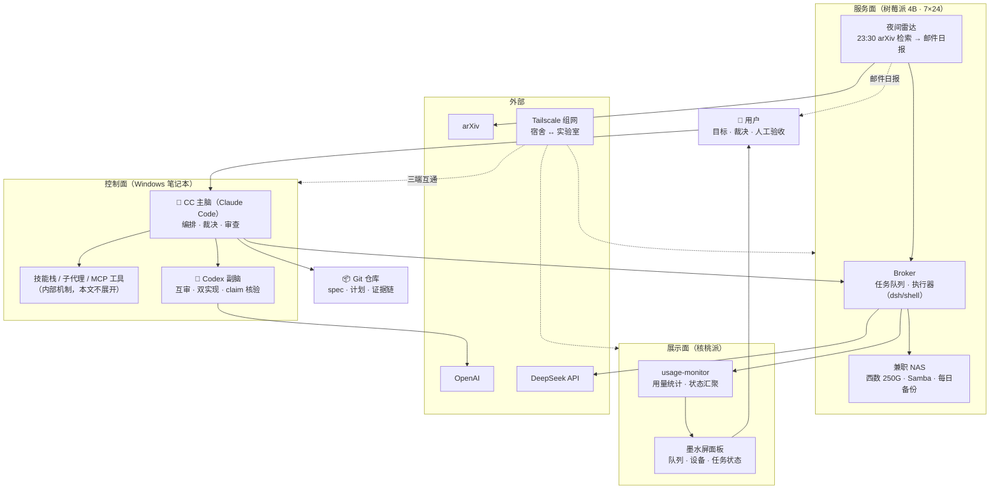
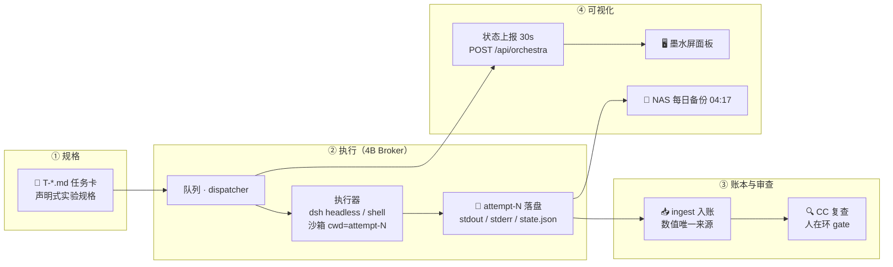

# CC 中心化研究工作流拓扑（对外介绍版）

> 用途：向第三方（导师/同事/合作者）介绍整套研究自动化工作流。两图分工：图 A 看架构分层与角色，图 B 看实验数据流。GitHub 可直接渲染；图片导出件存 D:\Temp\diagram\。

## 一句话导语（可直接粘贴）

我构建了一套以 Claude Code（CC）为中央编排者的研究自动化工作流：CC 负责全部任务的编排、裁决与审查，Codex 作为第二大脑交叉验证（代码互审、双实现、claim 核验，实证命中率 3/3）。实验层由树莓派 4B 上的 Broker 按声明式任务卡自动执行，结果落盘并每日备份到 NAS；状态实时推送到核桃派驱动的墨水屏面板；夜间雷达 23:30 自动检索 arXiv 文献并邮件日报。三台设备经 Tailscale 组网，宿舍与实验室无缝互通。

## 图 A：总体架构（三层 + 副脑）

## 图 B：实验数据流（任务卡 → 证据链）

## 图例

- **实线箭头**：数据 / 任务 / 指令流
- **虚线箭头**：网络组网或软性关联
- **圆角分组框**：子系统边界
- 图中不含任何凭据/代理细节——对外展示安全

## 关键数字（介绍时可引用）

- 四个子系统已验收：Pi Broker 实验执行、实验管线闭环、Codex 双 agent、墨水屏仪表盘
- 双 agent 交叉验证实证：历史代码独立审命中率 3/3（零误报）
- 设备：笔记本（编排）+ 树莓派 4B（执行/NAS）+ 核桃派（展示），Tailscale 三端互通
- 雷达每晚 23:30 自动检索，晨间邮件日报
