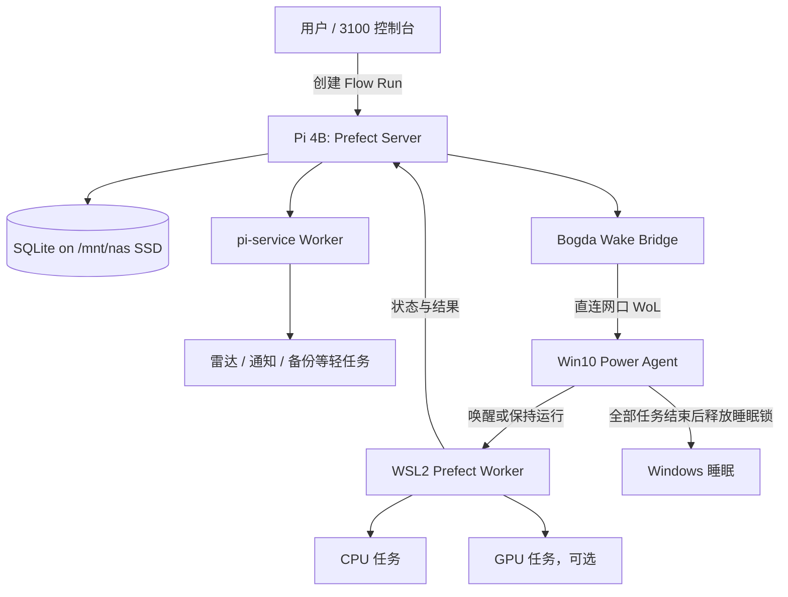

# Bogda 架构设计

> 日期：2026-08-24
>
> 状态：已批准
>
> 目标：在独立的 `bogda/` 中建设 Research Orchestra 的下一代内核，宿舍机到位并通过验收后再整体切换。

## 1. 定位

Bogda 是以 Prefect 3 为成熟调度内核的人机协同科研系统。它负责可靠排队、按需唤醒计算节点、执行研究工作流、保存产物和暴露人工决策点；它不把“程序执行成功”解释为“科研结论成立”。

人始终保留以下最终权限：

- 判断论文是否值得阅读；
- 批准关键研究计划和超出预算的实验；
- 判断实验结果能否支持结论；
- 批准对外发布、采购和其他不可逆操作。

第一阶段不原地重构 `orchestra/`。Bogda 使用新目录、新包和新运行时，旧 Orchestra 在切换前继续承担现网任务。

## 2. 已批准的关键决策

| 主题 | 决策 |
|---|---|
| 调度内核 | 使用现成 Prefect 3，不自研通用调度器 |
| 控制面 | Prefect Server 常驻树莓派 4B，采用 B-lite 方案 |
| 数据库 | 单机 SQLite；不在 2GB Pi 上部署 PostgreSQL、Redis 或 Kubernetes |
| Pi 存储 | Prefect 数据落现有 `/mnt/nas` 西数 250GB SSD，不落 SD 卡 |
| 计算节点 | Win10 Pro 22H2 + ESU，WSL2 Ubuntu 内运行 Prefect Worker 和研究任务 |
| 网络 | 宿舍 Wi-Fi/Tailscale 用于常规访问；Pi 与宿舍机直连网线用于 WoL 和 Prefect API |
| 并发 | Pi 最多一个系统任务；宿舍机最多一个研究任务 |
| 游戏 | 是宿舍机的附带用途，不为游戏提高预算；游戏模式暂停领取新研究任务 |
| 切换 | 新旧系统分阶段影子运行；不迁移运行中的任务，不立即删除旧数据 |

## 3. 系统拓扑



### 3.1 为什么选择 B-lite

任务直接进入 Pi 上的 Prefect Server，因此宿舍机休眠时仍可提交和查询任务。Prefect 是唯一队列与执行状态源，Bogda 不再额外维护 Gateway 请求数据库，也不需要维护 `job_id` 到 `flow_run_id` 的跨系统映射。

Pi 仍需运行一个很薄的 Wake Bridge。它只观察 Prefect 工作池并发送 WoL，不创建第二套任务状态机。

如果 Pi 真机资源验收失败，可把 Prefect Server 移到宿舍机并回退到 A 方案。Flow、执行器和任务契约不因此改变。

## 4. 设备职责

### 4.1 树莓派 4B 2GB

Pi 7×24 常开，承担：

- Prefect Server、UI 和 SQLite；
- Wake Bridge；
- `pi-service` Worker；
- 文献雷达、通知、备份等允许列表中的轻量任务；
- 现有 NAS 服务。

Pi 不执行任意论文代码，不运行无人监督的 agent 循环，不承接 CUDA 任务。

### 4.2 宿舍机

宿舍机按需唤醒，承担：

- WSL2 内的 Prefect Worker；
- CPU、Docker 和未来 GPU 研究任务；
- 大型数据集、模型权重和实验中间产物；
- Windows 原生游戏。

计划使用 Win10 Pro 22H2 + ESU。Windows 原生 Power Agent 管理睡眠抑制，因为 WSL 内的 Linux 进程不能可靠控制 Windows 主机电源状态。

机器电源模式为：

- `sleep`：没有研究任务，允许系统休眠；
- `compute`：领取研究任务并阻止休眠；
- `gaming`：停止领取新研究任务，不强杀正在运行的任务；
- `maintenance`：人工维护，不自动休眠或领取任务。

电源模式与科研自主模式互相独立。

### 4.3 当前笔记本

当前 i7-11800H、64GB、3060 Laptop 12GB 笔记本继续跟人移动。宿舍机到位前，它可以模拟 `dorm-x86` Worker 验证协议，但不承担 7×24 职责。

### 4.4 核桃派

核桃派继续承担墨水屏和冷备，不作为 Prefect 计算节点。

## 5. 网络与唤醒

宿舍没有有线网络基础设施，因此 Pi 和宿舍机都通过 Wi-Fi 接入互联网与 Tailscale。同时使用一根普通网线直连两台设备：

```text
Pi eth0       10.77.0.1/30
宿舍机网口    10.77.0.2/30
默认网关      不设置
```

直连网络只承担：

- Pi 向宿舍机发送 WoL；
- 宿舍机 Worker 访问 Pi Prefect API；
- 宿舍机上报电源和 Worker 健康状态。

这条链路不依赖宿舍 Wi-Fi 是否允许客户端互访。Prefect API 不暴露到公网；用户通过 Tailscale 或现有控制台访问。

第一版使用 Tailscale/直连网段作为网络边界，并启用 Prefect 自带的 Basic Auth。凭据只通过环境变量注入，不写入仓库；不为单用户系统增加独立身份服务。

Wake Bridge 的最小行为：

1. 查询 `dorm-x86` 是否存在待领取的 Flow Run；
2. 如果 Worker 不在线，向直连网口发送一次 WoL；
3. 在可配置冷却期内不重复发送；
4. 等待 Worker 上线，由 Prefect 完成任务领取；
5. 唤醒失败时保留原有 `Scheduled` 或 `Late` 状态并告警。

Wake Bridge 不直接修改 Flow Run 的执行状态。

## 6. 存储

仓库记录的 Pi 现状为：

- 现网 Orchestra 数据根是 SD 上的 `/home/liuxfs/broker-data`；
- `/mnt/broker` 是未挂载的旧 U 盘路径，不再作为新系统默认值；
- 西数 250GB SSD 已以 ext4 挂载到 `/mnt/nas`，并由 Pi 客串 NAS。

Bogda 使用现有 SSD，不新增存储硬件：

```text
/mnt/nas/
├── 现有 NAS 数据
└── .bogda/
    ├── prefect/
    │   └── prefect.db
    ├── snapshots/
    └── manifests/
```

约束：

- systemd 为 Prefect 设置 `PREFECT_HOME=/mnt/nas/.bogda/prefect`；
- SQLite 仅通过 Pi 本地 ext4 访问，不能通过 SMB 打开；
- `.bogda` 由服务账户持有，并从 Samba 共享中排除；
- 大型数据集、模型权重和中间产物留在宿舍机 SSD；
- Pi 保存控制面状态、结果摘要、产物位置和需要归档的小文件；
- 每日生成 SQLite 一致性快照；真正冷备进入核桃派现有备份链。

工业 SLC/pSLC SD 卡只影响 Pi 系统盘可靠性，不是 B-lite 的前置条件，暂列待决事项。

## 7. 软件边界

新目录建议采用以下职责划分：

```text
bogda/
├── pyproject.toml
├── README.md
├── src/bogda/
│   ├── contracts/       # JobRequest、RunResult 和科研状态
│   ├── flows/           # Prefect flows 与 deployments
│   ├── executors/       # shell、Docker、GPU 执行适配
│   ├── power/           # Wake Bridge 与 Power Agent 协议
│   ├── artifacts/       # 产物清单与必要产物验证
│   └── control/         # CLI/控制台调用 Prefect 的薄适配层
└── tests/
```

模块不得导入 `orchestra` 的内部实现。可以继承已验证的契约语义，但不能让新系统依赖旧 Broker 的数据库或文件扫描循环。

### 7.1 Prefect 的职责

- Flow Run 排队和状态；
- 步骤依赖、调度与超时；
- Worker 领取任务；
- 明确允许的重试；
- 日志、事件和运行历史；
- 工作池与并发限制。

### 7.2 Bogda 自建部分

- 科研任务与结果契约；
- 三档科研自主模式；
- WoL 和 Windows 电源控制；
- 研究执行器和产物验证；
- 科研结论的人工评审状态；
- 现有控制台的薄适配。

## 8. 工作池和并发

### 8.1 `pi-service`

- 只运行明确部署的雷达、通知、备份和系统维护 Flow；
- Worker 并发上限为 1；
- 不接受任意 shell、论文仓库或用户代码。

### 8.2 `dorm-x86`

- 包含 `cpu` 和 `gpu` 两个资源队列；
- CPU/GPU 表示资源要求，不表示允许同时运行；
- 单个宿舍 Worker 的总并发上限为 1；
- GPU 未安装时 Worker 不轮询 `gpu` 队列；
- `gaming` 模式停止 Worker 领取新任务。

因此系统第一版最多同时运行一个 Pi 轻任务和一个宿舍机研究任务。提高宿舍机并发列为后续优化，不进入第一版。

## 9. 科研自主模式

Bogda 提供三个可以切换的科研模式：

| 模式 | 行为 |
|---|---|
| `manual` | 每个研究步骤由人确认后执行 |
| `supervised` | 人批准研究计划，Bogda 自动执行、重试和收集结果；科学判断点暂停等待人处理 |
| `autonomous` | 在预设范围和预算内自行规划后续实验与迭代；科研结论、对外发布和新增支出仍由人批准 |

系统具有全局默认模式，每个项目可以覆盖默认值。创建 Flow Run 时将本次有效模式写入参数并冻结；修改全局或项目模式只影响后续运行。干预正在运行的任务必须显式暂停或取消。

## 10. 任务和结果语义

### 10.1 最小任务请求

Bogda 提交给 Flow 的请求至少包含：

```text
job_id
project_id
task_type
resource_class
autonomy_mode
parameters
retryable
expected_artifacts
```

`resource_class` 第一版只接受 `pi`、`cpu` 或 `gpu`。`autonomy_mode` 是创建 Flow Run 时解析并冻结的有效模式，不要求运行中的任务继续读取可变化的全局配置。

### 10.2 执行状态

执行状态直接使用 Prefect：

- `Scheduled`
- `Running`
- `Completed`
- `Failed`
- `Crashed`
- `Cancelled`

`Completed` 只表示流程执行完成且声明的必要产物存在。

### 10.3 科研判断状态

科研状态由 Bogda 单独保存：

- `unreviewed`：尚未审查；
- `accepted`：结果可信，可以进入后续论证；
- `rejected`：实验或推理存在问题；
- `inconclusive`：执行成功，但不能支持明确结论。

科研状态不反向篡改 Prefect 执行历史。`Completed + inconclusive` 是正常科研结果，不是系统故障。

### 10.4 最小结果契约

每次运行至少记录：

```text
run_id
execution_status
scientific_status
started_at
finished_at
executor
attempt
declared_artifacts
summary
```

`RunResult` 作为与 Flow Run 关联的版本化 Prefect Artifact 保存，当前最新版本是查询权威，旧版本保留评审变更历史。大型产物不写入控制面，只在 `declared_artifacts` 中记录路径或 URI、类型和必要的基本元数据。Bogda 不为科研状态再建设一套数据库。

命令退出码为零但缺少声明的必要产物时，执行状态必须为 `Failed`。第一版不做全文 Markdown 证据扫描、复杂摘要校验或与任务目标无关的防御性 schema。

### 10.5 重试

- 唤醒、临时网络请求和下载等基础设施步骤可以自动重试；
- 实验计算默认不进行完整自动重跑；
- 只有任务明确声明 `retryable: true` 时才重试实验步骤；
- 每次尝试使用独立目录，不覆盖先前产物。

## 11. 运行时数据流

1. 用户或 3100 控制台调用 Bogda 薄适配层创建 Prefect Flow Run。
2. Prefect 将任务置于对应工作池的 `Scheduled` 状态。
3. Pi 任务由 `pi-service` 领取；宿舍任务触发 Wake Bridge 检查并按需发送 WoL。
4. Windows 恢复后，Power Agent 进入 `compute` 并阻止休眠。
5. WSL2 Worker 连接 Pi API，从允许的队列领取一个任务。
6. 执行器在独立 attempt 目录中运行任务并生成产物清单。
7. 必要产物验证通过后，Prefect 记录执行终态；科研状态初始为 `unreviewed`。
8. 人或后续被批准的流程记录 `accepted`、`rejected` 或 `inconclusive`。
9. 宿舍机没有运行或待领取任务且不处于 `gaming/maintenance` 时，Power Agent 释放睡眠锁，由 Windows 电源策略休眠。

## 12. 故障语义

| 场景 | 结果 |
|---|---|
| 宿舍机未唤醒 | Flow Run 保持 `Scheduled/Late`；Wake Bridge 告警，不伪造失败或成功 |
| Worker 中途消失 | Prefect 记录相应异常状态；attempt 产物保留 |
| Pi 重启 | SQLite 保留队列和历史；服务恢复后继续调度 |
| Prefect API 暂时不可达 | Worker 使用 Prefect 自身通信恢复能力；第一版不增加第二套状态库 |
| 命令成功但必要产物缺失 | Flow Run `Failed` |
| 实验得到阴性或模糊结果 | 执行可为 `Completed`，科研状态为 `inconclusive` 或人工选择的状态 |
| 游戏模式开启 | 不领取新宿舍任务；当前任务自然结束后再进入游戏状态 |

系统不为低概率故障建设第二套队列、分布式共识或高可用控制面。Pi 故障是已接受的单点故障，恢复目标是保住 SQLite 和产物，不是无中断运行。

## 13. 迁移阶段

### 13.1 阶段 0：本地纵向切片

在 `bogda/` 中实现：

- 最小任务与结果契约；
- 本地 shell 执行器；
- 模拟 Wake Bridge；
- 一个 Prefect Flow 从提交到结果入账；
- 必要产物缺失时失败；
- 执行状态与科研状态分别查询。

本阶段不部署 Pi、不修改 Orchestra、不要求 Docker、CUDA 或新硬件。

### 13.2 阶段 1：Pi 影子运行

部署 Prefect Server、SQLite、Wake Bridge 和 `pi-service` Worker，只运行测试任务与健康检查。Orchestra Broker 继续承担真实任务。

Pi 需连续运行 72 小时，并验证：

- 无 OOM；
- 无持续 swap 抖动；
- 常见 API 操作响应时间不超过约 1 秒；
- 空闲可用内存最好保持 400MB 以上；
- 重启后排队任务仍存在；
- SQLite 快照可以恢复。

如果不达标，回退 A 方案，把 Prefect Server 移到宿舍机。

### 13.3 阶段 2：当前笔记本模拟宿舍机

验证 Worker 离线排队、上线领取、睡眠抑制、任务结束释放、游戏模式和单任务并发。笔记本只验证协议，不承担常驻职责。

### 13.4 阶段 3：宿舍机接入

宿舍硬件到位后配置 Win10、WSL2、直连网络和 WoL。首先开放 CPU 队列；显卡到位后才启用 GPU 队列。

### 13.5 阶段 4：正式切换

1. 停止向 Orchestra 提交新任务；
2. 等待旧队列清空；
3. 将 3100 控制台提交与查询入口改为 Prefect；
4. 新任务统一进入 Bogda；
5. Orchestra 代码、数据库和产物保留为只读历史。

不迁移运行中的任务，不把旧 Broker SQLite 批量转换为 Prefect 历史。切换验收失败时，提交入口可以回到 Orchestra。

## 14. 实施拆分

本设计描述目标架构，但不使用一个实施计划完成全部阶段：

1. 第一份计划只实现阶段 0 的本地纵向切片；
2. 阶段 0 验收后，单独编写 Pi 影子部署计划；
3. 当前笔记本模拟和真实宿舍机接入各自使用独立计划；
4. 3100 切换在 Bogda 控制面稳定后单独设计。

## 15. 第一版完成标准

- `bogda/` 是可独立安装和测试的 Python 项目；
- 一个本地任务可以通过 Prefect 完成提交、执行、产物验证和结果记录；
- 执行状态与科研判断状态严格分离；
- 同一宿舍节点的 CPU/GPU 任务共享并发上限 1；
- Wake Bridge 不拥有第二套任务状态；
- 旧 Orchestra 的文件、数据库和现网行为不受影响；
- 代码只实现当前需要的边界，不增加通用插件系统或全面防御性校验。

## 16. 待决与明确不做

### 16.1 待决

- 是否购买工业 SLC/pSLC SD 卡；
- 宿舍机出现真实排队瓶颈后是否提高并发；
- GPU 型号和启用时间；
- 宿舍机最终主板、CPU 和电源配置；
- Pi 真机资源验收后是否长期保留 B-lite；
- 3100 控制台切换的具体交互设计。

### 16.2 第一版明确不做

- 自研 Prefect 的替代调度内核；
- 在 Pi 上部署 PostgreSQL、Redis、Kubernetes 或任意论文执行环境；
- 自动认定科研结论成立；
- 为游戏升级预算；
- 全文证据扫描器；
- 原子 `releases/<sha>` 体系；
- Hermes、OpenClaw 或新的 IM 值班盒；
- 旧 Broker 历史数据的全量迁移。

## 17. 参考

- [Prefect Server](https://docs.prefect.io/v3/concepts/server)
- [Prefect Workers](https://docs.prefect.io/v3/concepts/workers)
- [Prefect Work Pools](https://docs.prefect.io/v3/concepts/work-pools)
- [Prefect States](https://docs.prefect.io/v3/concepts/states)
- [Research Orchestra 总设计](./2026-08-18-research-orchestra-design.md)
- [宿舍 Runner RFC](../../reports/2026-08-22-dorm-runner-rfc.md)
- [Orchestra 运行手册](../../../orchestra/README.md)
