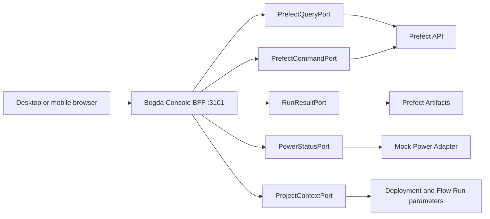

# Bogda Console Architecture and Product Design

**Date:** 2026-08-24
**Status:** Approved
**Branch:** `codex/bogda-console`
**Product root:** `bogda-console/`

## 1. Purpose

Bogda Console replaces the existing Orchestra console as the future control surface for Bogda without modifying the existing console, Orchestra data, or the concurrently developed `bogda/` core package.

The first release is a B-lite console:

- monitor Prefect execution;
- inspect and review versioned Bogda RunResult Artifacts;
- submit an explicitly registered Prefect Deployment;
- cancel a Flow Run;
- pause or resume a specific Deployment schedule or Work Queue;
- inspect `pi-service`, `dorm-x86`, shared dorm capacity, and dorm power mode.

The product is deliberately prepared for a later C release with project autonomy controls, but V1 does not store or change project autonomy policy.

## 2. Source Material

This design extends, and does not replace, the following approved documents:

- [Bogda architecture design](2026-08-24-bogda-architecture-design.md)
- [Bogda local vertical-slice plan](../plans/2026-08-24-bogda-local-vertical-slice.md)
- [Orchestra console design](2026-08-20-console-design.md)
- [Orchestra console V2 visual design](2026-08-20-console-v2-beautify.md)
- [`orchestra/console/README.md`](../../../orchestra/console/README.md)

The existing Orchestra console test baseline is 99 passing tests under Python 3.11. The old console remains the rollback surface throughout this project.

## 3. Goals

1. Make Prefect execution truth legible without creating a local task database or state machine.
2. Keep execution state and scientific judgment visibly and contractually separate.
3. Provide a useful B-lite operational loop while leaving an explicit, narrow path to C.
4. Make Worker, queue, shared capacity, and dorm power state understandable on desktop and mobile Tailnet access.
5. Handle the expected degraded states: Prefect unavailable, Worker offline, RunResult missing or invalid, and stale observations.
6. Produce a distinctive light interface based on Bogda mountain and field-observatory language rather than a generic AI dashboard.
7. Complete all development and acceptance on port 3101 without stopping, covering, or modifying the existing port 3100 service.

## 4. Non-goals

V1 does not:

- implement project autonomy-mode switching;
- create a project-policy database;
- create a task queue, task database, command outbox, event mirror, or alternate execution state machine;
- create arbitrary Flows, Deployments, commands, job variables, or shell payloads;
- freeze an arbitrary running operating-system process;
- implement a Power Agent, Wake-on-LAN, shutdown, sleep, or mode-change command;
- deploy to Pi or access the real dorm machine;
- modify `bogda/`, `orchestra/console/`, Orchestra databases, or existing runtime data;
- migrate old Broker history into Prefect;
- implement a full-text evidence scanner or generic Markdown verifier;
- introduce Hermes, OpenClaw, a generic plugin system, or a digital-twin framework;
- implement, document, or execute the final 3100 cutover procedure.

## 5. Architectural Decisions

### 5.1 Selected adaptation model

The browser calls a stateless backend-for-frontend (BFF) on the new console origin. The BFF owns Prefect credentials and exposes narrow query and command contracts.

Rejected alternatives:

- Direct browser-to-Prefect calls expose credentials and couple the UI to Prefect transport details.
- A synchronized local read model risks becoming a second task database and state machine.



### 5.2 Authority matrix

| Concern | Authority | Console behavior |
|---|---|---|
| Current Flow Run execution | Prefect API | Display raw Prefect state; never override locally |
| Worker, Work Pool, Work Queue | Prefect API | Display raw status and heartbeat observations |
| Scientific result and review | Latest RunResult Artifact with the run key | Append a new Artifact version for every review |
| Dorm power mode | PowerStatusPort | V1 uses a visibly labeled mock adapter |
| Effective autonomy for an existing run | Frozen JobRequest/Flow Run parameters | Read-only |
| Future project autonomy policy | Future Bogda ProjectPolicyPort | Unavailable in V1 |

### 5.3 No hidden fallback authority

A real adapter failure is displayed as unavailable or stale. It never silently swaps to a happy-path mock. An in-memory last-good snapshot is a read-only presentation aid, not a command input or source of truth.

## 6. Technology Boundary

### 6.1 Backend

- Python 3.11+
- FastAPI and Pydantic 2
- Prefect 3.8.3 client
- HTTPX for API and contract tests
- pytest

The backend package name is `bogda_console`; it does not import the concurrent `bogda/` worktree.

### 6.2 Frontend

- React 19
- TypeScript
- Vite
- React Router for the four product surfaces and details
- TanStack Query for transient server-view caching and polling
- custom CSS tokens and components
- Vitest and Testing Library
- Playwright and axe for browser acceptance

TanStack Query cache is not an authority. The UI renders freshness supplied by the BFF. Mutations do not run offline, do not use cached preconditions, and do not produce optimistic execution-state changes. Retry and refetch behavior is configured explicitly rather than relying on library defaults.

Tailwind, shadcn templates, SSR, and Next.js are intentionally excluded. The console requires a custom visual identity and does not benefit from server rendering.

### 6.3 Runtime layout

Production-style acceptance uses one FastAPI process to serve `/api/v1/*` and the built frontend on the configured host at port 3101.

Development may use:

- Vite as the public UI on port 3101;
- a BFF bound only to `127.0.0.1:3102` or another explicit non-3100 loopback port;
- a Vite `/api` proxy to the loopback BFF.

Every start entry point, test helper, and environment parser fails fast if asked to bind the new console or its internal BFF to port 3100.

The public host defaults to loopback. Tailnet testing may explicitly bind the console to a Tailnet address or an approved interface, while keeping port 3101.

## 7. Repository Boundary

```text
bogda-console/
├── README.md
├── pyproject.toml
├── package.json
├── src/bogda_console/
│   ├── app.py
│   ├── config.py
│   ├── api/
│   ├── contracts/
│   ├── adapters/
│   └── services/
├── frontend/
│   └── src/
├── fixtures/
├── tests/
│   ├── backend/
│   ├── frontend/
│   └── browser/
└── docs/acceptance/
```

No product file is added outside `bogda-console/`, except this approved design and its implementation plan under `docs/superpowers/`.

## 8. Thin Port Contracts

### 8.1 PrefectQueryPort

```text
health()
list_runs(filters, cursor)
get_run(run_id)
list_registered_deployments()
get_deployment(deployment_id)
list_work_pools()
list_work_queues(work_pool_name)
list_workers(work_pool_name)
get_work_pool_concurrency(work_pool_name)
```

### 8.2 PrefectCommandPort

```text
submit_registered_deployment(deployment_id, parameters, idempotency_key)
cancel_run(run_id)
pause_schedule(deployment_id, schedule_id)
resume_schedule(deployment_id, schedule_id)
pause_work_queue(queue_id)
resume_work_queue(queue_id)
```

There is no generic `execute(action)` method and no arbitrary `pause_run` command. A Prefect-native Paused or Suspended Flow Run is displayed faithfully, but V1 does not invent resume input or freeze a process.

### 8.3 RunResultPort

```text
get_latest(run_id)
list_versions(run_id, cursor, limit)
append_review(run_id, base_artifact_id, scientific_status, review_summary)
```

The Prefect query/command ports and RunResult port are wired to the same Prefect API workspace in every profile. V1 does not support a real Prefect run view paired with mock RunResult data, or the inverse.

### 8.4 PowerStatusPort

```text
get_dorm_status()
```

V1 implements this port only with mock fixtures.

### 8.5 ProjectContextPort

```text
get_run_context(run_id)
get_deployment_context(deployment_id)
```

It returns only read-only project and effective-autonomy context already frozen in a run request or configured as a Deployment default.

## 9. Source Observation Contract

Every independently degradable source returns:

```text
SourceMeta
  source
  sourceMode: real | mock
  observedAt: UTC ISO 8601 | null
  receivedAt: UTC ISO 8601
  lastSuccessfulAt: UTC ISO 8601 | null
  staleAfterSeconds: integer
  freshness: fresh | stale | unavailable
```

Definitions:

- `observedAt` is an authoritative timestamp supplied by, or derived from timestamps in, the represented source record. It is never fabricated from the browser request time. If the source supplies no meaningful observation timestamp, the value is null.
- `receivedAt` is when the BFF finished receiving the current response.
- `lastSuccessfulAt` is when the BFF most recently completed a valid source read.
- `fresh` means the latest authoritative read succeeded and has not crossed the source threshold.
- `stale` means a last-good snapshot exists but the current read failed or the source observation crossed its threshold.
- `unavailable` means no valid snapshot exists for this process.

All timestamps are UTC ISO 8601. The UI shows an absolute timestamp with a relative age; it never shows only “recently.”

## 10. HTTP API

### 10.1 Queries

```text
GET /api/v1/capabilities
GET /api/v1/overview
GET /api/v1/runs
GET /api/v1/runs/{runId}
GET /api/v1/runs/{runId}/result
GET /api/v1/runs/{runId}/result/versions
GET /api/v1/deployments
GET /api/v1/infrastructure
```

Query parameters are deliberately finite:

- `/runs`: opaque `cursor`, `limit` from 1 to 100, exact `executionType`, exact `scientificStatus`, `deploymentId`, and `projectId`;
- `/runs/{runId}/result/versions`: opaque `cursor` and `limit` from 1 to 100;
- `/deployments`: opaque `cursor` and `limit` from 1 to 100;
- all other query routes have no filters in V1.

List responses use `{items, nextCursor}`. Cursors are adapter-owned opaque strings; the BFF does not create a pagination database. Every HTTP response uses one envelope:

```text
ApiEnvelope<T>
  data: T | null
  sources: { sourceName: SourceMeta }
  errors: ApiError[]

ApiError
  code: ApiErrorCode
  message
  source
  retryable
  details?

ApiErrorDetails
  currentResource?: RunSummary | DeploymentSummary | QueueSnapshot | RunResultView
  fields?: Array<{field, message}>
  expected?
  observed?
```

`/runs`, `/runs/{runId}`, and `/deployments` require a Prefect snapshot. They return `200` with a `stale` last-good snapshot, or `503` with `data: null` when none exists. A `/runs` request with `scientificStatus` also requires a fresh or stale RunResult projection; if none exists the route returns `503` rather than silently returning an unfiltered list. `/runs/{runId}/result` and `/result/versions` apply the same rule to the RunResult source. Aggregate `/overview` and `/infrastructure` return partial `200` whenever at least one requested source has fresh or stale data; an unavailable component is `null` with a source-scoped error. They return `503` only when every requested dynamic component is unavailable with no last-good snapshot. `/capabilities` is configuration-derived and returns `200` even while a source is down.

Route payloads are closed V1 DTOs. `?` means nullable. Arrays inside an available source component are never null; an aggregate's entire source-owned array may be null only when its declared type has `?`, such as `InfrastructureView.pools`. Source ownership determines which component becomes null during partial degradation; an authoritative empty list is `[]`, never null.

```text
CapabilitySnapshot  [configuration]
  profile
  projectId
  effectiveAutonomyMode?
  canSubmitRegisteredDeployment
  canCancelRun
  canPauseSchedule
  canPauseWorkQueue
  canReviewScientificResult
  canSetAutonomyMode = false

ScientificSummary  [RunResult]
  availability: available | missing | invalid
  artifactId?
  artifactCreatedAt?
  scientificStatus?
  reviewSummary?
  validationIssues[]

ProjectContext  [ProjectContext]
  projectId
  effectiveAutonomyMode: manual | supervised | autonomous | null
  modeSource: frozen-run-request | deployment-default | unavailable
  writable: false

RunSummary  [Prefect plus nullable RunResult projection]
  runId
  name
  deploymentId?
  deploymentName?
  projectId?
  workPoolName?
  workQueueName?
  state: PrefectStateSnapshot
  scheduledAt?
  startedAt?
  endedAt?
  scientific: ScientificSummary?
  commandVersion

RunDetail  [Prefect plus ProjectContext]
  run: RunSummary
  parameters
  tags[]
  projectContext: ProjectContext?

RunResultView  [RunResult]
  availability: available | missing | invalid
  artifactId?
  artifactCreatedAt?
  result: ValidRunResult?
  validationIssues[]

RunResultVersionSummary  [RunResult]
  artifactId
  createdAt
  availability: available | invalid
  scientificStatus?
  reviewSummary?

DeploymentSummary  [Prefect plus ProjectContext]
  deploymentId
  name
  flowName
  projectContext: ProjectContext?
  workPoolName?
  workQueueName?
  parameterSchema
  allowlisted
  schedules[]: {scheduleId, label, active, updatedAt?, commandVersion}

QueueSnapshot  [Prefect]
  queueId
  name
  status
  isPaused
  concurrencyLimit?
  commandVersion

PoolSnapshot  [Prefect]
  name
  status
  isPaused
  concurrencyLimit?
  activeSlots
  queues: QueueSnapshot[]
  workers[]: {workerId, name, status, lastHeartbeatTime?}

PowerSnapshot  [Power]
  host
  mode: sleep | compute | gaming | maintenance | unknown
  agentReachable: true | false | unknown
  sleepInhibited: true | false | unknown
  lastTransitionAt?

OverviewSnapshot  [aggregate]
  execution: {countsByPrefectType, recentRuns: RunSummary[]}?
  science: {countsByScientificStatus, attentionRuns: RunSummary[]}?
  infrastructure: {piService: PoolSnapshot?, dormX86: PoolSnapshot?}?
  power: PowerSnapshot?

InfrastructureView  [aggregate]
  pools: PoolSnapshot[]?
  dormPower: PowerSnapshot?
```

Concrete route mapping:

- `/capabilities` -> `CapabilitySnapshot`;
- `/overview` -> `OverviewSnapshot`;
- `/runs` -> `{items: RunSummary[], nextCursor?}`;
- `/runs/{runId}` -> `RunDetail`;
- `/runs/{runId}/result` -> `RunResultView`;
- `/runs/{runId}/result/versions` -> `{items: RunResultVersionSummary[], nextCursor?}`;
- `/deployments` -> `{items: DeploymentSummary[], nextCursor?}`;
- `/infrastructure` -> `InfrastructureView`.

Only `RunSummary`, each `DeploymentSummary.schedules[]` member, and `QueueSnapshot` carry `commandVersion`, because those are the actionable Prefect resources. `ScientificSummary` is null when RunResult is unavailable for an aggregate/list projection; it is non-null with `missing` or `invalid` when the source answered authoritatively. `InfrastructureView.pools` and `dormPower` degrade independently. `ValidRunResult` is the exact validated payload in §12.1.

For `ProjectContext`, `modeSource = unavailable` if and only if `effectiveAutonomyMode = null`; `frozen-run-request` and `deployment-default` always carry exactly one of `manual`, `supervised`, or `autonomous`. If the entire ProjectContext source read fails, the owning `projectContext` field is null and the envelope carries `PROJECT_CONTEXT_UNAVAILABLE` instead of fabricating an `unavailable` context.

### 10.2 Commands

```text
POST /api/v1/deployments/{deploymentId}/runs
POST /api/v1/runs/{runId}/cancel
POST /api/v1/deployments/{deploymentId}/schedules/{scheduleId}/pause
POST /api/v1/deployments/{deploymentId}/schedules/{scheduleId}/resume
POST /api/v1/work-queues/{queueId}/pause
POST /api/v1/work-queues/{queueId}/resume
POST /api/v1/runs/{runId}/reviews
```

Command bodies are closed as follows:

```text
submit: {parameters, idempotencyKey}
cancel / schedule pause / schedule resume / queue pause / queue resume:
  {expectedCommandVersion}
review: {baseArtifactId, scientificStatus, reviewSummary?}

CommandReceipt<T>
  command
  resourceId
  acceptedAt
  snapshot: T
```

Successful Prefect commands return `ApiEnvelope<CommandReceipt<RunSummary | DeploymentSummary | QueueSnapshot>>`; review returns `ApiEnvelope<CommandReceipt<RunResultView>>`. A `409` envelope has `data: null` and includes the fresh `currentResource` in `ApiError.details` for `RESOURCE_CHANGED`, `COMMAND_NOT_APPLICABLE`, `COMMAND_OUTCOME_MISMATCH`, or `REVIEW_CONFLICT`. `422` details identify invalid fields. A post-command read failure returns `503 COMMAND_OUTCOME_UNKNOWN`, never a fabricated success snapshot; the browser warns that retrying may duplicate a non-idempotent command and requires a fresh read first.

### 10.3 Capabilities

Capabilities are explicit fields, not a plugin or action registry:

```text
canSubmitRegisteredDeployment
canCancelRun
canPauseSchedule
canPauseWorkQueue
canReviewScientificResult
canSetAutonomyMode = false
```

### 10.4 Command preconditions and receipts

Every command:

1. rejects a resource outside the configured allowlist;
2. performs a new authoritative Prefect or Artifact read on the server;
3. checks the command-specific precondition;
4. calls the source adapter;
5. reads the resource from the authority again;
6. returns the new authoritative snapshot.

S2 authorization uses exact server configuration sets for Deployment IDs, schedule IDs, Queue IDs, and Work Pool names. Submission requires an allowed Deployment. Schedule commands require both allowed schedule and Deployment IDs, and a fresh Prefect read must prove their current parent-child relation. Queue commands require allowed Queue and Work Pool identifiers plus fresh Prefect membership. Cancel and review authorize a dynamic Flow Run only when a fresh Prefect read shows its non-null `deploymentId` belongs to the allowed Deployment set; standalone runs are never mutable. A newly submitted run qualifies through the `deploymentId` in its authoritative Prefect post-read, not a local allowlist update. Review performs this Prefect ownership check before reading or appending the Artifact. The client never supplies a trusted parent or ownership claim.

Every actionable resource query exposes an opaque `commandVersion`. It is a deterministic digest of only authoritative fields already returned by Prefect: resource identity plus run state name/type/timestamp, schedule active state/update timestamp, or queue paused state/update timestamp. The browser must return it as `expectedCommandVersion` for cancel, schedule pause/resume, and queue pause/resume. It is not persisted and is not an execution state. The BFF recomputes it from the fresh pre-read; a mismatch returns `409 RESOURCE_CHANGED` before any adapter command.

Command-specific preconditions are exact:

- submit: registered Deployment is allowlisted and currently readable; the request contains `parameters` and a client-generated `idempotencyKey`;
- cancel: `expectedCommandVersion` matches and the Flow Run is non-terminal;
- pause schedule: version matches and that exact schedule is active;
- resume schedule: version matches and that exact schedule is inactive;
- pause queue: version matches and that exact queue is not paused;
- resume queue: version matches and that exact queue is paused;
- review: the latest Artifact is valid and its ID equals `baseArtifactId`.

Pause/resume and cancel are not silently treated as successful no-ops. If a fresh matching snapshot already has the requested state, the command returns `409 COMMAND_NOT_APPLICABLE`. `RESOURCE_CHANGED` means only that `expectedCommandVersion` differed from the server's fresh pre-read; it is a stale-intent guard, not an atomic Prefect compare-and-swap, and the console does not claim that it detects a non-cooperating external writer during the adapter-call window. A dorm Deployment submission additionally requires a fresh `dorm-x86` Work Pool concurrency limit of exactly one; otherwise it returns `409 INFRASTRUCTURE_MISCONFIGURED` without attempting submission. Prefect, not the console, enforces the limit at execution time.

All enabled mock and S2 command tests obey a single-process, single-writer, per-resource-serialized invariant: no external actor mutates an allowlisted resource during a command. S1 remains read-only. The adapter's accepted response followed by a readable authoritative post-snapshot is the receipt boundary. For synchronous pause/resume calls, a post-snapshot that does not show the requested boolean state returns `409 COMMAND_OUTCOME_MISMATCH` with that snapshot. Cancellation may validly post-read as Prefect `Cancelling` or `Cancelled`; either is a successful authoritative receipt. Any other post-read run state returns `409 COMMAND_OUTCOME_MISMATCH`. Supporting multi-writer production commands requires authority-provided CAS or documented Prefect transition semantics and is outside V1.

Commands never use last-good snapshots as preconditions. The browser does not optimistically change Prefect state.

Response rules:

- authoritative source unavailable: `503`;
- base version or command version changed: `409` with `REVIEW_CONFLICT` or `RESOURCE_CHANGED`;
- command precondition false on the matching current version: `409 COMMAND_NOT_APPLICABLE`;
- Prefect rejects an orchestration transition: `409 COMMAND_REJECTED`;
- accepted adapter call followed by an unexpected authoritative state: `409 COMMAND_OUTCOME_MISMATCH`;
- required Prefect concurrency configuration is absent or wrong: `409 INFRASTRUCTURE_MISCONFIGURED`;
- adapter accepted the command but the mandatory post-read failed: `503 COMMAND_OUTCOME_UNKNOWN`;
- invalid user input: `422`;
- successful command: authoritative post-command snapshot.

Deployment submission uses a client-generated idempotency key for retrying the same user action. The console does not persist idempotency records.

## 11. Execution State Semantics

### 11.1 Raw Prefect state

```text
PrefectStateSnapshot
  type
  name
  timestamp
  terminal
  message?
```

The exact Prefect name is the primary label. The six Bogda execution states remain the stable high-level vocabulary:

- `Scheduled`
- `Running`
- `Completed`
- `Failed`
- `Crashed`
- `Cancelled`

Prefect names within those types remain visible:

- `Late`, `AwaitingRetry`, and `AwaitingConcurrencySlot` remain visible under `SCHEDULED`;
- `Retrying` remains visible under `RUNNING`;
- `Cached`, `RolledBack`, and `TimedOut` remain visible under their actual Prefect type;
- `Pending`, `Paused`, `Suspended`, and `Cancelling` remain explicit rather than being forced into a misleading local category.

The console does not invent `hung` or another execution bucket.

### 11.2 Completed language

The fixed Completed explanation is:

> 执行完成，且声明的必要产物存在；这不代表科研结论已被接受。

The product must not describe Completed as “研究成功,” “结论成立,” or “验证通过.”

## 12. Scientific Review and RunResult

### 12.1 Artifact identity

```text
key  = bogda-run-{flowRunId}
type = bogda.run-result
```

The newest Artifact with this key and type is the scientific-result authority, even when its payload is invalid. The console never skips an invalid newest version to promote an older valid version. Previous versions remain visible as history and may identify the last valid payload, but cannot become the current scientific result until a newer valid Artifact is appended by the authority.

A payload is valid only when it parses as an object containing the core RunResult contract below. Unknown additional fields are retained so the thin adapter remains forward-compatible; invalid enum values, missing required fields, malformed UTC timestamps, or malformed artifact records make the whole newest payload `invalid`.

```text
run_id: string
job_id: string
execution_status: Scheduled | Running | Completed | Failed | Crashed | Cancelled
scientific_status: unreviewed | accepted | rejected | inconclusive
started_at: UTC ISO 8601
finished_at: UTC ISO 8601
executor: non-empty string
attempt: integer >= 1
declared_artifacts: Array<{uri: string, kind: string, exists: boolean, size_bytes: integer | null}>
summary: string
review_summary: string | null
```

### 12.2 Availability

```text
available
missing
invalid
```

- A non-terminal run without a RunResult displays “结果尚未生成.”
- A terminal run without a RunResult displays “RunResult 缺失” and appears in attention surfaces.
- An invalid payload displays “RunResult 无法解析” with the Artifact ID.
- The console does not infer a replacement result from logs, Markdown, or directories.

### 12.3 Execution snapshot versus authority

`RunResult.execution_status` is a historical snapshot. The current Prefect state remains the execution authority. If they differ, both are shown with an “Artifact 记录较旧或不一致” explanation.

### 12.4 Review states

- `unreviewed`: 待评审
- `accepted`: 结果可信，可进入后续论证
- `rejected`: 实验、方法或证据存在问题
- `inconclusive`: 当前结果不足以支持明确结论

No backend rule rewrites a scientific status because of an execution status. A non-Completed terminal run may be reviewed when a valid RunResult exists, with the execution warning remaining visible.

### 12.5 Append-only review

Review input:

```text
baseArtifactId
scientificStatus
reviewSummary: string | null
```

The BFF serializes reviews per run within the V1 process, re-reads the newest Artifact, verifies `baseArtifactId`, preserves all other payload fields including unknown fields, changes only `scientific_status` and `review_summary`, and creates a new Artifact with the same key and type.

The existing Artifact is never updated in place. A base-version mismatch returns `409 REVIEW_CONFLICT`, preserves the user's input in the browser, displays the newer version, and requires confirmation before resubmission.

V1 does not claim reviewer identity because the approved core contract has no identity field. Artifact version timestamps provide temporal lineage.

Review commands have an explicit single-writer invariant: the V1 BFF runs as exactly one process/replica, all scientific-review writes for its allowlisted resources pass through that BFF, and a terminal run producer does not append a replacement RunResult after handing the result to review. Startup refuses to enable `canReviewScientificResult` when configured for more than one replica. This invariant, the per-run lock, and the fresh `baseArtifactId` check are the V1 concurrency boundary; the spec does not claim atomic compare-and-swap against a non-cooperating external Artifact writer. S1 real shadow remains read-only. A future multi-writer deployment requires an authority-provided CAS/lease contract and is outside V1.

### 12.6 Declared artifacts

The UI displays only declared URI, kind, existence, and basic size metadata. It may copy or open a supported URI, but it does not proxy or scan large outputs.

## 13. Infrastructure and Power

### 13.1 Prefect topology

The HTTP wire shape is the single canonical `InfrastructureView` composed from `PoolSnapshot`, `QueueSnapshot`, and `PowerSnapshot` in §10.1. Adapter-native Prefect objects are mapped into those DTOs and never cross the HTTP boundary. All source metadata exists only in `ApiEnvelope.sources`; it is not duplicated inside infrastructure or power payloads.

Raw states remain distinct:

- Work Pool: `READY`, `NOT_READY`, `PAUSED`
- Work Queue: `READY`, `NOT_READY`, `PAUSED`
- Worker: `ONLINE`, `OFFLINE`

Worker OFFLINE is a valid fresh Prefect fact. It is not equivalent to Prefect API unavailable or dorm power `sleep`.

### 13.2 pi-service

`pi-service` has an independent concurrency limit of one and accepts only explicitly deployed lightweight service work. It does not accept arbitrary research code.

### 13.3 dorm-x86

`dorm-x86` contains `cpu` and `gpu` queues. In V1 the authoritative scheduler constraint is the Prefect `dorm-x86` Work Pool concurrency limit, which must equal one:

```text
dorm-x86 shared capacity: activeSlots / 1
├── cpu queue
└── gpu queue
```

The adapter reads that Work Pool limit and the shared pool active-slot count; queue-level limits never replace or add to the displayed shared capacity. If the pool limit is absent or not one, the UI shows “共享并发配置异常” with the observed value, and dorm submission is disabled as specified in §10.4. The console does not implement a host semaphore or copy Prefect scheduling logic. The UI must not render `CPU 0/1 + GPU 0/1`. GPU `NOT_READY` does not prove missing hardware; “GPU 尚未启用” appears only when an adapter explicitly supplies that configuration fact.

### 13.4 PowerSnapshot

The single canonical HTTP `PowerSnapshot` is defined in §10.1. `host` is `dorm-x86` in V1, and `lastTransitionAt` is either a UTC ISO 8601 value or null. Source freshness and the visible mock/real label come from `ApiEnvelope.sources.power`, never an embedded `sourceMeta` field.

V1 Power data is read-only and mock-backed. Every Power surface includes a visible “模拟数据” label. There are no real power commands.

Mode interpretation:

| Mode | Expected behavior |
|---|---|
| `sleep` | No research work; Windows may sleep |
| `compute` | Research work may be claimed; sleep is inhibited |
| `gaming` | New research work is not claimed; existing work is not killed |
| `maintenance` | Manual maintenance; no automatic claiming or sleep |
| `unknown` | Do not infer a mode |

Power mode, Worker state, queue state, and Prefect state are presented together but never collapsed into a persisted host-health state.

## 14. Degraded Operation

### 14.1 Partial-source rendering

Prefect, RunResult, and Power sources degrade independently. A Power failure does not blank runs. One invalid RunResult does not blank the page. A Prefect failure does not fabricate zero runs or “all healthy.”

### 14.2 Last-good snapshots

The BFF may retain a process-local last-good read snapshot. It clears on restart and is never written to disk.

- If the current read fails and a snapshot exists, return the data as `stale` with its source timestamps.
- If no snapshot exists, return `unavailable`.
- Commands never use this snapshot.

### 14.3 Focused issue taxonomy

```text
PREFECT_UNAVAILABLE
RUN_RESULT_UNAVAILABLE
POWER_UNAVAILABLE
PROJECT_CONTEXT_UNAVAILABLE
RESULT_MISSING
RESULT_INVALID
REVIEW_CONFLICT
RESOURCE_CHANGED
RESOURCE_NOT_ALLOWLISTED
COMMAND_NOT_APPLICABLE
COMMAND_REJECTED
COMMAND_OUTCOME_MISMATCH
COMMAND_OUTCOME_UNKNOWN
INFRASTRUCTURE_MISCONFIGURED
NOT_FOUND
VALIDATION_ERROR
INTERNAL_ERROR
```

`ApiErrorCode` is exactly the closed set above. The BFF does not emit ad-hoc strings. `RESOURCE_NOT_ALLOWLISTED` is `403`; `NOT_FOUND` is `404`; the command conflicts listed in §10.4 are `409`; `VALIDATION_ERROR` is `422`; source-unavailable and `COMMAND_OUTCOME_UNKNOWN` errors are `503`; an unexpected server failure is `500 INTERNAL_ERROR`. `RESULT_MISSING` and `RESULT_INVALID` may accompany a successful partial envelope because they describe scientific-result availability rather than a failed HTTP request. This list is intentionally narrow. It is not a generic error-plugin framework.

### 14.4 Presentation

- Persistent or page-local degradation banners remain visible until fresh data returns.
- Errors include source, absolute observation time, and a useful next action.
- Status never relies on color alone.
- A toast may confirm a command, but it is never the only place an error or changed state appears.

## 15. Information Architecture

### 15.1 Overview

The overview is attention-led, not a KPI card wall. It contains:

1. API, Worker, stale-data, and RunResult attention items;
2. active runs;
3. results awaiting review;
4. dorm shared capacity and Power mode;
5. recent execution and scientific outcomes.

The old calendar is not the new home page. During shadow operation, a clearly labeled link returns to the legacy 3100 console; legacy data is not merged into the new page.

### 15.2 Runs

- filterable run ledger;
- exact Prefect name and type;
- separate scientific status column;
- registered-Deployment submission drawer;
- exact cancel, schedule-pause, and queue-pause actions.

Run detail uses two persistent bands:

1. Prefect execution truth;
2. RunResult and scientific review.

### 15.3 Reviews

- unreviewed queue;
- reviewed history;
- missing or invalid result group;
- current Artifact and version history;
- append-only review form with conflict handling.

### 15.4 Infrastructure

- `pi-service` Pool, queues, Workers, and independent capacity;
- `dorm-x86` Pool, CPU/GPU queues, Workers, and one shared capacity;
- Power mode and mock-source disclosure;
- observation times and degradation messages.

## 16. C-ready Boundary

V1 exposes read-only context:

```text
projectId
effectiveAutonomyMode: manual | supervised | autonomous | null
modeSource: frozen-run-request | deployment-default | unavailable
writable: false
```

`modeSource = unavailable` is the only context-level representation of an unknown configured mode and requires a null value, as specified in §10.1. A failed ProjectContext source read is instead represented by a null component plus `PROJECT_CONTEXT_UNAVAILABLE`.

The UI has no hidden mode editor. `canSetAutonomyMode` is false. A later C release adds a specific Bogda `ProjectPolicyPort`; it does not expand PrefectCommandPort into a generic action registry and does not store policy in the console.

## 17. Visual Design

### 17.1 Direction

The direction is “Bogda mountain observatory”: a calm scientific field instrument with topographic structure, not a dark AI cockpit.

Reference lessons, not skins:

- MLflow: run list to run detail to artifact lineage;
- Tailscale: readable device ledgers, last-seen facts, and read-only-first control;
- Swisstopo: contour hierarchy, terrain marks, and route-red emphasis;
- Prefect: exact operational state names.

### 17.2 Tokens

| Token | Value | Purpose |
|---|---|---|
| Snow field | `#F3F6F4` | page background |
| Observation paper | `#FFFFFF` | primary surface |
| Alpine ink | `#10231D` | primary text |
| Field note | `#56645F` | secondary text |
| Conifer | `#1F4D3F` | brand and accepted state |
| Lake blue | `#2A6273` | running and information |
| Contour umber | `#806C55` | terrain marks and quiet structure |
| Route red | `#B9362A` | destructive or urgent attention |
| Alpine amber | `#986515` | inconclusive and stale attention |
| Moraine line | `#CAD4CF` | borders and dividers |

The implementation must verify actual contrast rather than assuming tokens pass. There are no gradients and no default dark theme in V1.

### 17.3 Typography

- Manrope Variable for display and UI Latin text;
- system CJK stack for Chinese body text;
- IBM Plex Mono for IDs, timestamps, queue names, and counts.

Font assets are bundled at build time. Tailnet use does not depend on Google Fonts or another public CDN.

### 17.4 Signature element

A restrained Bogda ridge and contour band identifies the product and may encode `pi`, `cpu`, and `gpu` state. It is never the only status channel. Text plus an icon or shape appears in the same surface. A purely decorative ridge is `aria-hidden`.

### 17.5 Layout

Desktop uses a quiet navigation rail and a 12-column content grid. Attention and run ledgers receive more area than ornamental metrics. Surfaces use disciplined spacing and dividers instead of a uniform matrix of floating cards.

Mobile uses:

- a compact masthead;
- four-item bottom navigation;
- record lists instead of squeezed desktop tables;
- full-screen run and review details;
- sticky primary actions where necessary;
- touch targets at least 44 CSS pixels.

Motion is limited to meaningful state and panel transitions. `prefers-reduced-motion` removes nonessential motion.

## 18. Accessibility and Responsive Acceptance

Target: WCAG 2.2 AA.

Required checks:

- 360, 390, 768, 1280, and 1440 CSS-pixel viewports;
- 320 CSS-pixel reflow or an equivalent 1280-pixel viewport at 400% zoom;
- 200% zoom;
- no bidirectional scrolling except a genuinely two-dimensional data surface;
- body contrast at least 4.5:1 and applicable UI/large-text contrast at least 3:1;
- visible keyboard focus;
- skip link and semantic landmarks;
- semantic tables on desktop and equivalent labeled records on mobile;
- dialog focus trap, Escape handling, and focus restoration;
- status conveyed through text plus icon/shape, never color alone;
- polite live announcements for user-triggered refresh and command results without announcing every poll;
- reduced motion honored;
- controls and status copy remain understandable in Chinese while preserving exact English Prefect names.

## 19. Mock Strategy

### 19.1 Adapter parity

Mock and production adapters implement the same Protocols and return the same DTOs. Fixtures are deterministic and use an injectable clock.

### 19.2 Scenarios

```text
normal-active
sleep-queued
gaming-paused
degraded-stale
result-missing-invalid-conflict
mobile-dense
```

The fixtures collectively cover all four Power modes.

### 19.3 Mutation behavior

Mock commands update process memory only and reset on restart. A test-only scenario-control endpoint may exist only when both mock mode and test mode are enabled. It is absent in real mode.

### 19.4 Mixed mode

V1 supports only these named wiring profiles:

| Profile | Prefect query | Prefect command | RunResult Artifact | Power |
|---|---|---|---|---|
| `mock-all` | mock | mock, enabled by allowlist | mock | mock |
| `real-readonly` | real | real adapter wired but all capabilities disabled | real, same Prefect workspace | mock |
| `allowlisted-test` | disposable/local real Prefect | enabled only for exact test allowlists | real, same Prefect workspace | mock |

Power is mock-only in V1 and always says “模拟数据.” Prefect and RunResult must use the same profile/workspace; unsupported cross-combinations fail startup configuration validation. Each source still independently identifies `sourceMode`, because it may degrade independently. A real failure never activates mock implicitly.

## 20. Shadow Operation and Cutover Gate

### 20.1 Stage S0: isolated mock and local development

- new product only under `bogda-console/`;
- public port 3101;
- no real Prefect, Pi, dorm machine, or 3100 mutation;
- all command interactions use mock or a disposable local Prefect test harness.

### 20.2 Stage S1: real Prefect read-only shadow

- explicitly configured real Prefect adapter;
- all command capabilities disabled;
- no silent mock fallback;
- compare console observations with Prefect without altering either system.

### 20.3 Stage S2: allowlisted test commands

- separately and explicitly enabled;
- only disposable local Prefect or exact test Deployment, schedule, and Queue allowlists;
- no production or unknown resource can be mutated;
- existing 3100 continues serving Orchestra.

### 20.4 Stage S3: 3101 evidence package

The package contains:

- automated test outputs;
- accessibility results;
- representative screenshots;
- interaction matrix results;
- read-only confirmation that 3100 remained accessible before and after acceptance;
- explicit list of files, services, data, and devices not modified.

### 20.5 Cutover approval gate

This project stops at the evidence package. Only after the user explicitly approves the shadow result may a new design describe switching 3100. This spec contains no stop-service, port-change, reverse-proxy, deployment, or data-migration command.

The future rollback principle is switching the entry point back to the preserved Orchestra console, not converting or deleting historical data.

## 21. Browser Acceptance

### 21.1 Viewports

```text
1440 x 900
1280 x 800
768 x 1024
390 x 844
360 x 800
320 CSS-pixel reflow
```

### 21.2 Interaction coverage

- navigate all four primary pages;
- open and close run and review details with correct focus restoration;
- filter runs by exact execution and scientific state;
- submit an allowlisted registered Deployment in mock/local Prefect;
- request cancellation and render the authoritative post-command state;
- pause and resume a schedule;
- pause and resume a Work Queue;
- append a review version;
- preserve review input and require confirmation on `409 REVIEW_CONFLICT`;
- render Prefect unavailable with and without a last-good snapshot;
- render Worker OFFLINE as a fresh Prefect fact;
- render RunResult missing and invalid;
- render stale Power independently from fresh Prefect data;
- render `sleep`, `compute`, `gaming`, and `maintenance` with “模拟数据.”

### 21.3 Automated accessibility

axe scans:

- all four main pages;
- run detail;
- review detail and form;
- infrastructure detail;
- at least one degraded state.

There must be no serious or critical violations. Keyboard paths, focus restoration, reduced motion, zoom, and reflow receive explicit tests or recorded manual evidence.

### 21.4 Browser error criteria

A scenario fails acceptance for:

- an uncaught JavaScript exception;
- a non-scenario-expected 4xx or 5xx response;
- a failed static resource;
- a React warning;
- rendering an expected error as success.

An intentionally injected `503` in an unavailable-source scenario is expected and does not fail merely because of its status code.

### 21.5 Screenshots

At least these representative captures are saved under `bogda-console/docs/acceptance/`:

1. overview, desktop;
2. run detail, desktop;
3. scientific review, phone;
4. infrastructure or degraded state, phone.

## 22. Acceptance Assertions

- [ ] New product files exist only under `bogda-console/`, plus approved spec and plan documents.
- [ ] Prefect is the only current execution authority; no local task store or state machine exists.
- [ ] The newest same-key/type RunResult Artifact is the scientific authority; an invalid newest version does not fall back, and reviews append versions.
- [ ] Prefect state and scientific state are separate in DTOs, copy, filtering, and visual treatment.
- [ ] `Completed + unreviewed` is simultaneously visible on desktop and phone.
- [ ] Completed copy never implies a scientific conclusion.
- [ ] Raw names including `Late`, `Retrying`, and `Paused` remain visible.
- [ ] Every real command performs a fresh authoritative server read and authoritative post-command read.
- [ ] Cancel and pause/resume require a matching opaque command version and have exact non-idempotent preconditions.
- [ ] Review writes are enabled only under the documented single-process, single-writer invariant.
- [ ] Last-good snapshots are process-local, read-only, and absent from write decisions.
- [ ] Prefect unavailable never renders zero runs or “all healthy.”
- [ ] Worker OFFLINE remains distinct from API unavailable and Power `sleep`.
- [ ] Partial Power or RunResult failure does not blank unrelated data.
- [ ] `pi-service` and `dorm-x86` are separate.
- [ ] Dorm CPU and GPU queues display one shared total capacity of one.
- [ ] Prefect `dorm-x86` Work Pool concurrency is the sole V1 shared-capacity authority; misconfiguration is visible and blocks submission.
- [ ] The UI never renders separate CPU and GPU capacities that imply concurrency two.
- [ ] All four Power modes are represented and every mock Power surface says “模拟数据.”
- [ ] `canSetAutonomyMode` is false and no hidden policy store or mode-write route exists.
- [ ] Mock state resets on restart and deterministic clocks make screenshots repeatable.
- [ ] Real adapter failure never silently selects a mock adapter.
- [ ] Only the three named source-wiring profiles start successfully; Prefect and RunResult share one workspace.
- [ ] The only public new-console port during development and acceptance is 3101.
- [ ] Development BFF is loopback-only on a non-3100 port.
- [ ] All launch and test paths fail fast for port 3100.
- [ ] Real Prefect shadow mode has all command capabilities disabled.
- [ ] Command tests affect only mock, disposable local Prefect, or exact allowlisted test resources.
- [ ] 3100 is read-only reachable before and after acceptance and was not stopped or covered.
- [ ] 360, 390, 768, 1280, 1440, 200% zoom, and 320-pixel reflow checks pass.
- [ ] Keyboard, focus restoration, 44-pixel targets, non-color status, and reduced motion checks pass.
- [ ] axe reports no serious or critical violations on the required surfaces.
- [ ] Browser scenarios cover API unavailable, Worker offline, missing/invalid RunResult, stale data, review conflict, and every Power mode.
- [ ] At least four representative acceptance screenshots are saved.
- [ ] No Pi deployment, real power operation, `bogda/` modification, old-console modification, or Orchestra data migration occurred.
- [ ] The repository contains no actual 3100 cutover command or procedure.

## 23. External References

- [Prefect states](https://docs.prefect.io/v3/concepts/states)
- [Prefect workers](https://docs.prefect.io/v3/concepts/workers)
- [Prefect work pools and queues](https://docs.prefect.io/v3/concepts/work-pools)
- [Prefect deployments](https://docs.prefect.io/v3/concepts/deployments)
- [Prefect deployment schedule management](https://docs.prefect.io/v3/how-to-guides/deployments/manage-schedules)
- [Prefect Artifact lineage](https://docs.prefect.io/v3/how-to-guides/workflows/artifacts)
- [Prefect latest Artifact API](https://docs.prefect.io/v3/api-ref/rest-api/server/artifacts/read-latest-artifacts)
- [MLflow Tracking](https://mlflow.org/docs/latest/ml/tracking/)
- [Tailscale device filtering](https://tailscale.com/docs/features/access-control/device-management/how-to/filter)
- [Swisstopo map-reading guide](https://www.swisstopo.admin.ch/dam/en/sd-web/LQOiovlrcX-c/Broschuere_Kartenlesen_Internet_2025_E.pdf)
- [WCAG 2.2](https://www.w3.org/TR/WCAG22/)
