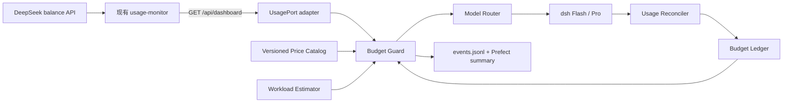

# Bogda 智能协作、模型路由与预算保护设计

> 日期：2026-08-28
>
> 状态：待用户复核
>
> 范围：设计与迁移契约；本文件本身不授权修改现网、切换 3100、接入 `pi-service` 或宣布 Gate 6/7 通过

## 1. 背景与定位

Bogda 是 Research Orchestra 的下一代系统，而不是 Orchestra 上方的 Prefect 执行层。Orchestra 在迁移期间继续承担现网任务；正式切换完成后冻结为只读历史，不长期保留双调度、双任务事实源或双控制台行为。

Bogda 的目标是成为一个更智能的科研协作体：理解研究目标，制定计划，调用工具执行，阅读产物，判断下一步，在授权范围内迭代，并在科学判断、对外发布、支出等关键节点暂停等待人类决定。

Prefect 仍是唯一调度和执行状态内核。Bogda 不把模型调用、预算判断或科研状态做成第二套队列。

## 2. 设计目标

- 将合作权限、任务意图、模型能力和执行器分成正交维度。
- 复用 Orchestra 已验证的任务意图语义，同时避免让 Bogda 依赖 Orchestra 内部实现。
- 允许 Flash 在预算内自动升级为 Pro，并为低风险任务提供受控降级。
- 在发起付费调用前检查余额、价格窗口和任务预算，避免长任务中途因余额耗尽而失控。
- 根据预期工作量、运行时间和 DeepSeek 峰谷价格生成不过紧的动态预算。
- 为每次路由、预算决策、模型调用、暂停和恢复生成结构化运行日志。
- 保留完整 prompt 作为受控研究产物，同时避免在普通日志中泄露秘密或堆积大文本。
- 为未来新增模型提供方、执行器和任务类型保留稳定接口，不预先建设通用插件平台。

## 3. 非目标

- Pro 不获得比 Flash 更多的工具或操作权限。
- `autonomous` 不授权科研结论、对外发布、新增支出或超预算实验。
- 不在本设计中切换 3100、启用 3101 真写入或修改现网 `deploy/pi` unit。
- 不用常驻 LLM、常驻 dsh 会话或轮询 agent 实现“智能”。agent 必须由事件触发，完成有限工作后退出。
- 不让 Bogda 直接导入 `orchestra` 包、读取旧 Broker SQLite 或依赖旧任务扫描循环。
- 不把墙钟运行时间直接乘以单价；DeepSeek 按 token 计费，时间只影响价格窗口和调度选择。

## 4. 四个正交维度

### 4.1 `autonomy_mode`：允许自主到哪里

| 值 | 中文 | 人类职责 | Bogda 职责 |
|---|---|---|---|
| `manual` | 手动 | 逐步批准 | 分析、建议并等待 |
| `supervised` | 监督执行 | 批准计划和科学判断 | 执行、恢复、重试、整理证据 |
| `autonomous` | 范围内自主 | 设定目标、边界和关键裁决 | 在冻结范围和预算内规划、执行、评估、迭代和汇报 |

`autonomy_mode` 是可切换的合作模式，不是 Bogda 的成熟度阶段。全局默认可以被项目覆盖；创建运行时解析并冻结，后续策略修改不影响已创建运行。

### 4.2 `intent`：这次工作采用什么认知方式

Bogda 第一版继承 Orchestra 的五种任务意图，但将旧字段 `mode` 改名为 `intent`，避免与 `autonomy_mode` 混淆。

| 值 | 含义 |
|---|---|
| `execute` | 按已批准步骤执行并产出声明结果 |
| `explore` | 发散搜索后收敛，明确不确定性和候选方向 |
| `decide` | 比较选项、权衡代价并给出有依据的推荐 |
| `audit` | 寻找缺陷、反证、遗漏和不一致 |
| `brief` | 去重、压缩并生成可行动简报 |

这些值是跨任务类型的稳定认知意图。文献筛选、实验分析和论文审稿属于 `task_type` 或 skill，不应不断膨胀 `intent` 枚举。

### 4.3 `model_tier`：需要多强的推理能力

第一版接受：

- `flash`：默认、低成本，适合执行、简报和常规探索。
- `pro`：更强推理能力，适合复杂探索、决策和审计。
- `auto`：允许 Bogda 根据意图、工作量、风险和预算选择 Flash 或 Pro。

模型档位只改变能力和价格，不改变工具白名单、文件权限、网络权限、autonomy 边界或人工审批要求。

### 4.4 `executor`：由谁完成调用

第一版兼容 `dsh` 和 `shell`。未来可以增加其他执行适配器，但任务意图不能与某个执行器绑定：`audit` 不等于 dsh，`pro` 也不等于某个固定命令行实现。

## 5. 版本化任务契约

Bogda 的目标任务契约至少包含：

```yaml
schema_version: 1
task_type: literature_review
intent: audit
model_tier: auto
autonomy_mode: supervised
executor: dsh
budget:
  max_cost_cny: "5.32"
  minimum_remaining_cny: "10.00"
```

契约规则：

- `schema_version` 必填并显式校验。
- 未知 `intent`、`model_tier` 或 `autonomy_mode` 必须拒绝，不能静默回退。
- 运行创建后冻结解析出的 autonomy、预算和路由约束。
- 执行器只消费规范化后的 Bogda 契约，不读取 Orchestra task card。

### 5.1 Orchestra 兼容层

旧任务卡通过单向适配器转换：

```text
Orchestra                     Bogda
mode: audit          ->        intent: audit
model: pro           ->        model_tier: pro
executor: dsh        ->        executor: dsh
```

兼容层只负责解析、验证和转换，不双写状态，不让 Bogda 依赖旧 Broker。转换后的 Bogda 契约是唯一权威输入。历史任务保持只读。

## 6. 模型路由与降级

默认建议：

| Intent | 默认档位 | Pro 不可用或预算不足时 |
|---|---|---|
| `execute` | Flash | 自动降级 Flash |
| `brief` | Flash | 自动降级 Flash |
| `explore` | Flash；复杂时升级 Pro | 可降级，结果必须标记能力降级 |
| `decide` | Pro | 暂停，等待 Pro 或人工批准 Flash |
| `audit` | Pro | 暂停，不静默降低审查质量 |

自动 Flash → Pro 升级必须同时满足：

- 当前意图和工作量需要更强推理；
- autonomy 允许继续执行当前步骤；
- 预算门禁重新检查通过；
- 运行日志记录升级原因、请求档位和实际档位。

人工可以将单次任务锁定为 Flash 或 Pro。锁定 Flash 时不得自动升级；锁定 Pro 但预算不足时按上表暂停或降级规则处理。

## 7. 用量与预算架构

### 7.1 组件边界



Bogda 通过 `UsagePort` 消费现有用量监控服务，不导入其内部模块。DeepSeek API key 继续留在用量监控服务；Bogda 只持有访问内网监控 API 所需的 `MONITOR_TOKEN`。

余额是硬门禁的权威外部信号。Platform cookie 抓取的详细用量可用于展示和历史估算，但不得在余额字段过期时替代余额门禁。

### 7.2 用量快照

规范化快照至少包含：

```yaml
provider: deepseek
available: true
total_balance: "42.18"
currency: CNY
observed_at: 2026-08-28T12:00:00+08:00
source_status: up
```

规则：

- 金额使用十进制定点值，在 JSON 中序列化为字符串。
- 快照超过 120 秒视为过期。
- 服务不可用、响应非法、币种不匹配或快照过期时 fail-closed。
- fail-closed 阻止新的付费调用；不抹除已完成产物。

### 7.3 预算继承与冻结

预算解析优先级：

```text
单次运行明确预算 > 项目预算 > 全局默认预算
```

下层策略默认只能收紧。提高已有运行的预算必须由人显式批准，并记录原因、批准人、旧值和新值。

每次运行冻结 `RunBudgetEnvelope`：

```yaml
currency: CNY
expected_cost: "2.88"
authorized_ceiling: "5.32"
minimum_remaining: "10.00"
requested_tier: pro
fallback_tier: flash
budget_source: project
pricing_version: deepseek-cn-2026-08-28
```

autonomous 模式可以在预算包内自主迭代，但不能扩大预算、充值或突破最低余额。

## 8. DeepSeek 峰谷价格目录

价格目录必须版本化并带生效时间、复核截止时间、币种、时区和官方来源。运行超过 `review_by` 后 fail-closed，必须重新核对官方价格并生成新版本。以下快照来自 2026-08-28 用户提供的 DeepSeek 官方价格页，单位均为人民币元/百万 tokens。

| 档位 | 时段 | 缓存命中输入 | 缓存未命中输入 | 输出 |
|---|---|---:|---:|---:|
| Flash | 空闲 | 0.05 | 1.50 | 4.50 |
| Flash | 高峰 | 0.10 | 3.00 | 9.00 |
| Pro | 空闲 | 0.15 | 4.50 | 13.50 |
| Pro | 高峰 | 0.30 | 9.00 | 27.00 |

高峰时段采用北京时间：周一至周五 `09:00–12:00`、`14:00–18:00`；其余为空闲时段。空闲价格为高峰价格的一半。

运行时不得把这些数值散落硬编码在路由器或 UI 中。价格目录变更必须生成新版本，已有运行继续引用创建时冻结的版本；如果官方价格上调导致冻结预算失真，实时余额与实际用量对账仍可触发安全暂停。

## 9. 工作量预测与动态预算

### 9.1 预测输入

`WorkloadEstimate` 至少考虑：

- 任务类型和 `intent`；
- Flash/Pro 请求档位；
- 预计模型调用次数；
- 预计缓存命中和未命中输入 tokens；
- 预计输出 tokens；
- 允许的重试次数；
- 预计开始时间、运行时长和 deadline；
- 相同任务类型、意图和档位的历史 p50/p90 实际用量。

墙钟时间不直接产生费用，但决定调用可能落入哪个价格窗口。跨越峰谷边界且无法确定具体调用时间时，未开始的调用按较高价格估算。

### 9.2 费用公式

```text
expected_cost
= cache_hit_input_tokens   / 1_000_000 * cache_hit_price
+  cache_miss_input_tokens / 1_000_000 * cache_miss_price
+  output_tokens           / 1_000_000 * output_price
```

启动阶段默认按缓存未命中估算；只有可验证的历史命中率才能降低这部分预测。缓存命中形成节省，不作为任务能否完成的前提。

### 9.3 不过紧的授权上限

```text
authorized_ceiling
= max(expected_cost * contingency_factor, historical_p90_cost)
+ retry_reserve
```

原则：

- Flash 常规执行和简报使用较低安全系数。
- Pro 的 explore、decide 和 audit 使用较高安全系数。
- 历史数据不足时采用保守启动值；积累实际数据后按任务族滚动校准。
- 每次模型响应返回实际 token 后立即对账，更新剩余预测和可用预算。
- `authorized_ceiling` 是可完成任务的合理上界，不是刻意压缩模型输出的目标。

### 9.4 预算预留

可启动余额定义为：

```text
available_to_start
= current_balance
- active_reservations
- minimum_remaining
```

第一版对付费 dsh 模型调用使用全局单飞预算锁，与当前低并发约束一致。未来提高模型调用并发前，必须将 `BudgetLedger` 换成支持原子预留和释放的实现；不能仅依赖读取余额后各自判断。

## 10. 峰谷感知调度

每个付费任务可以声明：

```yaml
schedule_policy:
  earliest_start: 2026-08-28T18:00:00+08:00
  deadline: 2026-08-29T08:00:00+08:00
  price_preference: cheapest_before_deadline
```

调度规则：

- 用户要求立即执行：按当前价格和可能跨入的高峰价格准备预算。
- 有 deadline 但不紧急：在 deadline 前优先进入空闲时段。
- 无 deadline 的后台 Pro 任务：默认等待空闲时段。
- 前端必须显示因价格优化而计划的启动时间、预计节省和当前价格窗口。
- 人可以选择“立即按高峰价运行”；该操作重新计算预算并生成审批事件。
- 已开始的单次调用不因进入高峰而强杀。后续调用重新预测并通过门禁。

## 11. 运行时数据流

1. 用户或触发器提交规范化 Bogda 任务。
2. Bogda 解析并冻结 `autonomy_mode`、`intent`、模型约束和预算继承结果。
3. Workload Estimator 生成 token、调用次数、时长和费用预测。
4. Scheduler 根据 deadline 和峰谷时段确定计划启动时间。
5. Budget Guard 获取不超过 120 秒的余额快照，检查最低余额、运行上限和活动预留。
6. Model Router 选择 Flash 或 Pro，并记录请求档位、实际档位和理由。
7. dsh 发起调用前写入 `model_call_started`；响应后写入实际 usage 并对账。
8. Flash 自动升级 Pro 前重复步骤 5–7。
9. 余额或运行预算不足时，不发起下一次调用；保存产物并使用 Prefect 可重新调度的暂停/挂起机制释放 worker，不在进程内睡眠等待。
10. 余额恢复且快照新鲜后重新检查，满足原冻结预算才恢复；恢复不会自动扩大预算。
11. 执行完成只代表流程和必要产物完成；科研结论仍进入独立评审状态。

## 12. 结构化运行日志与 prompt 归档

### 12.1 事件日志

每次运行都生成追加写的 `events.jsonl`。至少支持：

- `budget_snapshot`
- `budget_reserved`
- `budget_released`
- `route_selected`
- `tier_upgrade_requested`
- `tier_downgraded`
- `model_call_started`
- `model_call_finished`
- `budget_paused`
- `budget_resumed`
- `budget_override_approved`

示例：

```json
{"event":"tier_downgraded","run_id":"run-123","intent":"explore","requested_tier":"pro","effective_tier":"flash","reason":"insufficient_budget","balance_cny":"13.42","reserved_cny":"5.00","minimum_remaining_cny":"10.00","snapshot_age_seconds":18,"occurred_at":"2026-08-28T20:10:00+08:00"}
```

每条事件包含稳定的 schema 版本、run/call 标识、北京时间或带偏移的 ISO 8601 时间、路由原因和相关预算快照引用。

`model_call_started` 已写而没有对应 `model_call_finished` 时，系统必须标记费用可能已经发生但结果未知，下一次恢复先对账，不能假定未消费。

### 12.2 Prefect 摘要

Prefect 日志和 Artifact 保存面向人的摘要、当前预算状态和 `events.jsonl` 引用。`events.jsonl` 是详细运行审计源；Prefect 摘要不能成为另一套不一致的事实源。

### 12.3 Prompt 与模型输出

- 普通事件日志只记录 `prompt_hash` 和 `prompt_artifact` 路径。
- 完整 prompt 作为受控、版本化研究产物保存。
- 完整模型输出进入声明的运行产物，不重复嵌入每条事件。
- API key、Authorization、`X-Monitor-Token` 和其他秘密不得写入任何日志或产物。
- prompt 归档失败时，不得继续发起不可复现的付费科研调用。

## 13. 前端呈现

现有“科研自主模式”面板继续只负责 autonomy，不把模型和预算塞入同一控件。

运行创建和详情页另设模型/预算区，显示：

- `intent`；
- 请求档位和实际档位；
- 当前余额、快照年龄和来源状态；
- 预期费用、授权上限、已用金额和剩余预留；
- 当前峰谷窗口、计划启动时间和预计节省；
- 自动升级、降级、暂停或人工覆盖原因；
- 指向结构化事件日志和 prompt 产物的入口。

预算不足、价格目录不可用和用量快照过期必须使用不同状态文案，不能统一显示为“模型不可用”。

## 14. 故障语义

| 场景 | 行为 |
|---|---|
| 用量 API 不可达 | fail-closed，不启动新付费调用 |
| 快照超过 120 秒 | fail-closed，记录 `stale_usage_snapshot` |
| 余额低于最低保留线 | 暂停，不降为科研失败 |
| 运行达到授权上限 | 保存产物并暂停，等待人工提高预算或结束任务 |
| Pro 预算不足，intent 为 execute/brief/explore | 按策略降级 Flash并记录；explore 标注质量降级 |
| Pro 预算不足，intent 为 decide/audit | 暂停，不静默降级 |
| 价格目录缺失或失效 | fail-closed，不猜测价格 |
| 调用开始后进程崩溃 | 标记费用未知，恢复前先对账 |
| 实际消耗显著高于预测 | 提高后续预测安全系数并触发告警，不扩大当前预算 |
| 任务等待空闲时段但 deadline 临近 | 重新计算高峰预算；预算允许则启动，否则请求人工决定 |

## 15. 可维护性与扩展规则

- 领域契约、价格目录、路由策略和执行器适配分模块维护。
- 行为策略集中定义，不能在前端、dsh prompt 和 Flow 中复制三套条件分支。
- 新模型提供方通过 `UsagePort`、`PricingPort` 和执行适配器接入，不修改 autonomy 语义。
- 新执行器不应迫使任务契约增加供应商专用字段；供应商扩展放入有命名空间的执行配置。
- 新任务类型优先复用五种 intent；新增 intent 需要契约版本评审。
- 金额计算统一使用 Decimal；时间统一保存带时区值，价格判断固定使用 `Asia/Shanghai`。
- 价格目录和运行日志 schema 必须有版本，不解析未知版本。
- 任何提高并发的设计都必须先解决预算原子预留，不能复用单飞实现。

## 16. 测试策略

### 16.1 单元测试

- 四种核心维度互不越权。
- Orchestra `mode/model/executor` 到 Bogda 契约的兼容转换。
- 北京时间工作日两个高峰区间及边界分钟。
- Flash/Pro、峰/谷、缓存命中/未命中的费用计算。
- Decimal 精度和 JSON 字符串序列化。
- 动态预算安全系数、p90 和重试预留。
- execute/brief/explore 的降级与 decide/audit 的暂停。
- autonomy 和预算创建时冻结。
- 日志脱敏、事件配对和未知费用恢复。

### 16.2 契约测试

- 用量监控正常、过期、缺字段、币种错误和未授权响应。
- 价格目录版本和失效处理。
- dsh 返回 usage、缺少 usage 和调用中断。
- prompt 归档成功后才允许付费调用。

### 16.3 集成测试

- 使用 fake usage provider 和 fake dsh 完成 Flash 运行。
- Flash 在预算内升级 Pro。
- Pro 任务跨峰谷边界重新预测。
- 余额不足后挂起、释放 worker、余额恢复后继续。
- 调用开始但无结束事件时先对账再恢复。
- 并发模型调用被全局预算锁拒绝。

### 16.4 前端测试

- autonomy 面板保持原有全局/项目覆盖行为。
- 模型预算区正确显示请求与实际档位。
- stale、insufficient、scheduled-off-peak 和 awaiting-approval 文案可区分。
- “立即按高峰价运行”展示重算金额并要求确认。

## 17. 分阶段落地

1. 契约阶段：引入 `intent`、`model_tier`、预算和日志 schema，以及 Orchestra 单向适配测试。
2. 只读阶段：Bogda 通过 `UsagePort` 读取现有用量监控 API，只展示不阻断。
3. 影子门禁：计算预算决策并写日志，但由现有执行路径继续运行，用于校准预测。
4. 强制门禁：先对 Flash 任务启用 fail-closed、预留、暂停与恢复。
5. Pro 路由：启用自动升级、按 intent 降级规则和峰谷调度。
6. 前端阶段：展示预算、价格窗口、计划启动、覆盖审批和运行审计。
7. 切换阶段：在独立验收和 owner 批准后，才将真实任务从 Orchestra 迁入 Bogda。

以上阶段均不授权在 Gate 6 窗内修改现网 Prefect、systemd unit、并发设置、`prefect.db` 或密钥内容。

## 18. 验收标准

- 任一付费调用都能追溯到冻结的任务意图、模型档位、autonomy 和预算包。
- Pro 提升能力但不扩大工具权限或自主权限。
- 用量快照不可用或超过 120 秒时不会发起新的付费调用。
- 预算根据 token 工作量、预计调用、运行时段、历史数据和风险余量生成，不采用固定小额上限。
- 非紧急 Pro 任务可在 deadline 内自动等待空闲时段，前端可见且可人工覆盖。
- execute/brief/explore 可以按策略降级；decide/audit 不会静默降级。
- 每个模型调用都有可配对的结构化事件；中断调用被标记为费用未知。
- 完整 prompt 可复现但不进入普通事件日志，秘密不会落盘。
- Orchestra 任务可单向转换，Bogda 不依赖 Orchestra 的包、数据库或扫描循环。
- 现有 autonomy 全局/项目覆盖及运行冻结语义不回归。

## 19. 关联文档

- [Bogda 架构设计](./2026-08-24-bogda-architecture-design.md)
- [Research Orchestra 总架构设计](./2026-08-18-research-orchestra-design.md)
- [Bogda Console 设计](./2026-08-24-bogda-console-design.md)
- [模型路由设计](./2026-08-20-model-routing-design.md)
- [Bogda 可维护性缺口](../../reports/2026-08-28-bogda-maintainability-for-sol.md)
- [DeepSeek 官方模型与价格](https://api-docs.deepseek.com/zh-cn/quick_start/pricing)
