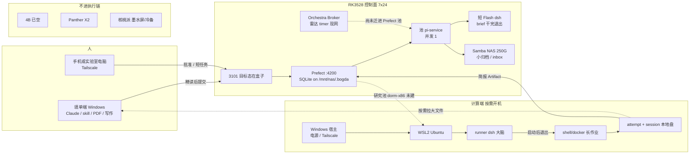

# Bogda：本机填单、双 dsh 分工与 runner 会话

<!-- campus-runner-status:2026-09-10 -->
> 2026-09-10 现状更新：Orchestra/3100 已停用；Y7000 已接入 WSL2、NAS 和 dorm-x86，并发 1，自主 smoke 与 WSL 重启恢复通过。checkpoint key 本地修复已测、尚未部署，DEF-03 未通过现网验收。3101 仍为只读 observer。下文历史设计/操作步骤不代表已经部署；“runner 未到手/未联网/仅雷达停用”等旧状态以[最新交接](../../reports/2026-09-10-bogda-runner-handoff.md)为准。共享 SQLite 和日志发布接线仍待完成。
<!-- /campus-runner-status -->

> 日期：2026-08-30
>
> 状态：owner 已冻结（2026-08-30）。本地开工包准入已落代码；现网 A/B 仍未接。
>
> 范围：设计与迁移契约。本文不授权改现网 unit、不宣布 Gate 6/7 通过、不接 `pi-service` 研究 Flow、不把 Orchestra 改成远程执行器。

## 1. 定位

进组前（入学 2026-09-08）科研主路径建设 **Bogda**，不把 Orchestra 继续当成生产科研调度器来加功能。Orchestra 现网保留文献日报与日历；Broker/雷达可继续跑，但不再新开「远程派到 runner」过渡栈。

人在本机填冻结任务单（Claude 或 3101）。RK3528 只排队、叫醒、记状态。实验思考、配环境、跑命令在 **runner**（当前为第二台笔记本，尚未接 Prefect）。卡点回 3101。

Prefect 仍是唯一队列与执行状态源。dsh 不是第二套调度器。

## 2. 已拍板

| 主题 | 决策 |
|---|---|
| 填单 | 本机完成；附件/PDF 路径写入请求，不把 PDF 当盒子自动精读输入 |
| 队列 | RK3528 Prefect（目标态）。现网研究 Flow 仍禁，直到 Gate 6/7 + owner 批 3101 真写入 |
| 复现/配环境/长思考 | runner 上的 dsh，不在 3528 |
| dsh 生命周期 | 有活才跑进程；卡点或结案则退出。用 dsh session id **resume**，不 7×24 占着 CPU/token |
| 会话落盘 | runner 本地。Prefect Artifact 只存 session id 与产物路径。禁止把 runner 会话写到 3528 USB NAS |
| 配环境 | 已批准镜像内、白名单小改（如若干 pip）可由监管模型放行；出白名单、联网拉数、科学结论必须 3101 |
| Prompt / 监管 | 只调行为或提供意见；机械白名单才是权限墙 |
| 监管批准上限 | 不能与人等效；不能把 `scientific_status` 写成 accepted |
| Orchestra | 日报 + 日历；不建设 `executor: remote` 过渡 |
| Panther X2 | RK3566 / USB 2.0。不当 NAS、不当复现 runner、不抢控制面 |
| 入学前完成线 | **A：** Gate 6/7 + 3101 对现网 Prefect 提交/暂停/审批。**B：** runner + dsh resume + 监管小改 —— 契约先准备，硬件到位再接 |
| 3528 轻量 dsh | **要。** 见 §4。7×24 的是盒子能接短任务，不是常驻思考会话 |
| 盒子 dsh 唤醒 | **Prefect 入队，worker 拉起进程。** 见 §4.1。不另开常驻 dsh / SSH 手搓生产路径 |
| 本机不可用 | **可以指挥盒子做白名单短活**，前提是指挥面不跑在那台本机上。见 §4.1。复现/GPU 仍要 runner |
| 本机收结果 | **简报进 Prefect Artifact / 3101；大包留 runner。** 见 §5.1。禁止把实验全集灌 USB NAS |
| 本机 skill | **整棵不复制到 runner/盒子。** 见 §5.2。随任务走的是冻结 runbook，不是 `~/.claude/skills` |
| 角色 | **填单端 / 控制面 / 计算端** 按职责，不按主机名。见 §3.1 |
| 研究任务池 | **禁止**落到 `pi-service`。轻任务与复现分池；误派则 worker 拒绝 |
| 附件 | 必须是计算端可解析的引用（git+commit、已暂存路径、小文件 inbox），禁止仅 `D:\` 本机路径 |
| 长作业 | GPU/训练走 shell/docker 墙钟；dsh 只在思考/配环境/收束时拉起，训练过程不烧 token |
| 计算端唤醒 | 宿舍机 + Wake Bridge 仍是架构目标；当前第二台笔记本 **人工开机领取**，任务停在 Scheduled。见 §5.5 |
| 计算端系统 | **Windows 宿主管电源；WSL2 Ubuntu 跑 worker / dsh / docker / 实验。** 见 §5.6。不是裸 Linux 盒子，不是 Mac，不是 3528 |
| 本机 Claude vs runner | **不直连指挥。** 派活/暂停/批准走盒子 Prefect（3101）。Claude 填单、读简报；SSH 只排障 |

## 3. 目标闭环

```text
文献/开题/精读/写作     → 填单端（本机 skill，不派盒子、不派 runner）
雷达日报               → 现网 Orchestra（邮箱）；不与 Bogda 科研 Run 双写
填冻结任务单           → 3101（目标态在盒子）或本机代填后提交
选池入队               → 轻任务 pi-service；复现/环境 → 研究池（未建成则不得提交到现网）
材料                   → 计算端可解析引用到位，否则 blocked_missing_inputs
唤醒计算端             → 有活才开机（现：人开第二台笔记本；目标：Wake Bridge）
短认知                 → runner dsh（session 可 resume）
长墙钟                 → shell/docker；dsh 退出
卡点                   → 3101（白名单外 / >20 CNY / usage_unknown / 科学判断 / 联网拉数）
批准后                 → 计算端再领取；dsh resume 同 session
简报                   → Artifact / 3101；大文件留 runner；可选小归档 NAS
评审                   → 人点 scientific_status；写作回填单端
空闲                   → dsh 退出；计算端可睡；控制面 7×24
```

`Completed` 只表示声明产物在。认不认复现成功仍是科研状态，人点。

## 3.1 三角色（不要用主机名当合同）

| 角色 | 现在是谁 | 干什么 | 关机之后还在吗 |
|---|---|---|---|
| 填单端 | 跟人走的 Windows（Claude、skill、PDF、`.paper`） | 读论文、立题、写 runbook、写论文 | 否。关机则精读/写作停 |
| 控制面 | RK3528：Prefect、目标态 3101、轻量 dsh、NAS 小归档 | 排队、批准、短 Flash、状态 | 是。7×24 |
| 计算端 | 第二台笔记本（未接池）；目标宿舍机 `dorm-x86` | 环境、实验、大文件、runner dsh | 否。关机则复现停，已入队的停在 Scheduled |

实验室电脑或手机经 Tailscale 打开的是 **控制面**，不是自动变成填单端：没有本机 PDF/skill，就不能假装已经精读完。计算端也不是第二填单端：不装整棵 skill。

**本机 Claude 不能当 runner 的遥控器。** 它可以写任务单、调 3101、读 Artifact；真正拉起/暂停/resume dsh 的是盒子上的 Prefect worker。本机 SSH 进第二台笔记本手开 dsh 只算排障（和 SSH 盒子手敲一样）。否则会有两套调度：本机一关就断、还绕过预算门和 3101 批准。

## 3.2 拓扑（现在 vs 目标）

图例：实线 = 现网或已锁定合同；虚线 = 未接（研究池 / Wake Bridge / 3101 托管在盒子）。



对照：

| 看图时 | 含义 |
|---|---|
| 中间一列 | 唯一队列。所有「有没有活」问 Prefect，不问 dsh |
| 左列上两框 | 填单 vs 指挥。手机只能指挥控制面，不能当精读机 |
| 右列虚线 | 第二台笔记本合同已写，现网还没 worker |
| `pi-service` | 盒子轻任务，不是研究 runner |
| 底部分支 | 4B / Panther / 核桃派都不跑实验 |

可交互的同一张图：会话画布 `bogda-topology`（现在 / 目标 / 数据 三页）。

## 4. 为什么 3528 也要轻量 dsh（以及它不是 runner 大脑）

盒子 7×24，适合 **随时可执行的短认知活**：摘要、去重、雷达类短 prompt、把失败译成人能看的说明。这些不该等 runner 开机。

它不适合当复现大脑：4GB 与 Prefect、Samba、Broker 争内存；USB NAS 已有断盘记录；无 GPU；`pi-service` 合同仍是轻任务、并发 1；常驻 dsh 会话会烧 token，且与「闲时不烧、能力面要白名单」冲突。

因此 3528 dsh 必须同时满足：

1. **按任务拉起，干完退出**（和 runner 同一生命周期哲学）。7×24 指 worker/盒子在，不指 dsh 进程在。
2. **只 Flash、短 timeout、无 docker/conda/任意 shell 科研环境。** 禁止在盒子上为论文配环境。
3. **intent 白名单**（第一版建议：`brief` 以及已批准的雷达/通知文案类）。`explore`/`audit` 长推理、配环境、跑实验代码走 runner。
4. **会话若需要，只落 eMMC/broker 数据盘**（现网 `/home/liuxfs/broker-data`），不落 `/mnt/nas` USB。
5. **与 `pi-service` 轻任务同一并发预算**：控制面仍最多一个系统任务；盒子 dsh 与雷达/备份互斥，不另开常驻第二脑。
6. **预算与 usage：** 走同一套官方余额门和 ≤20 CNY 自动帽；盒子 dsh 同样要能对账（现网 dsh 不写 Bogda `usage.json` 仍是缺口，A 阶段可先记，B 阶段与 runner 一起补桥）。

现网 Orchestra 盒子上的 dsh 已是「短 prompt 手脚」。Bogda 接轻量 dsh 是把这层收进 Prefect 允许列表，不是新开 7×24 agent loop。触发式 agent 总开关仍见架构 spec §16.1；本文件只批准 **允许列表内的短 headless 调用**。

## 4.1 盒子 dsh 怎么醒；本机挂了能不能指挥

**唤醒机制（唯一生产路径）：** 人（或已批准的定时 Deployment）向 RK3528 Prefect **创建一个允许列表内的 Flow Run** → 常驻的 `pi-service` worker 接到任务 → `subprocess` 拉起一次 headless Flash dsh → stdout/artifact 写回 → **进程退出**。盒子上 systemd 保活的是 Prefect server + worker，不是 dsh。没有「先 ping 再唤醒 dsh 守护进程」这一层。

不允许作为产品路径的：

- SSH 登录盒子手敲 `dsh`（排障可以，日常指挥不算）
- 盒子上 7×24 挂着一个 dsh session 等人说话
- 本机 Claude 当注入器：本机不可用时这条路本来就断了

**本机不可用时：可以指挥盒子，但不能指挥「本机才有的能力」。**

「本机」指填单/Claude 那台 Windows。它关机后：

| 仍在 | 不在 |
|---|---|
| RK3528、Prefect `:4200`、`pi-service`、轻量 dsh 能力 | 本机 Claude、本机 3101（若只绑 `127.0.0.1`）、PDF 精读、未开机的 runner |

因此：**可以**用 3101（或同等人机面）直接让盒子干白名单短活（`brief`、已批的雷达/通知文案、失败译成人话）。**不可以**在本机和 runner 都关机时要求复现、配 conda、跑实验——那些不在盒子合同里。

这要求指挥面 **7×24 可达且不依赖那台 Windows**：

1. **推荐：** 3101（或更薄的「提交白名单短任务 / 批准暂停」页）跑在 RK3528 上，经 Tailscale 从手机或实验室电脑打开。A 完成线的「3101 真写入 Prefect」与此同向：写入目标就是盒子上的 Prefect，UI 也应能在盒子侧被访问，而不是只活在本机 localhost。
2. **应急：** 盒子 Prefect UI `:4200` 手工点 Run（差、易误触研究 Deployment，只作 A 未完成时的逃生，不作日常）。
3. **不推荐：** 把 3101 永远只跑在研究笔记本上，再幻想本机挂了还能点批准。

手机/外网只走 Tailscale，不把 3101/4200 暴露到公网。提交体必须带 **intent**；worker 拒绝未知 intent 与研究复现 Deployment。并发仍与雷达/备份共用 `pi-service` 一槽：盒子正在备份时，短 dsh 排队，不插队打爆 4GB。

定时唤醒（雷达类）走 Prefect Deployment/Cron，与人手点 3101 是同一条「入队 → worker → 短 dsh → 退出」管道，不是第二条 agent。

## 5. Runner dsh（大脑，非 7×24）

- 思考、探测环境、起草方案、执行已批准命令、收 stdout。
- 一单复现共用 session id；3101 等待期间进程退出。
- 监管模型可放行「已批准镜像内的小改」；其余 resume 前必须人批。
- 第二台笔记本未接 Prefect 前，不在现网冒充已上线。契约（session Artifact、白名单表、监管端口）可在 A 并行设计。

## 5.1 本机怎么接收实验数据和实验简报

两套东西，两条路。混在一起会把 250G USB 盘和 Prefect SQLite 灌死。

**实验简报（给人看、给 Claude 看）：小、结构化、跟 Run 走。**

- 权威入口是 3101 运行详情里的最新 `RunResult` Artifact：摘要、关键数字、失败原因、下一步建议、`declared_artifacts` 清单。
- 体积上限：Markdown 简报 + 小 JSON（metrics / 产物索引）。由 runner 在结案或卡点时写出；也可另开盒子 `brief` intent，**只读已发布的小文件**，不读 runner 上的原始数据集。
- 本机 Claude 只吃这份简报和清单，不把 checkpoint / 原始轨迹塞进上下文。
- 本机关机时简报仍在 Prefect（盘在盒子上）。开机后打开 3101 即可见，无需 runner 仍开机。

**实验数据（字节本体）：大、留在产生它的盘上，本机按需拉。**

- 权威字节在 **runner 本地 attempt 目录**（与 dsh session 同一台机器）。不把权重、日志全集、中间 ckpt 复制到 `/mnt/nas`。
- Prefect 只存 URI、kind、size、是否存在；不存 blob。
- 本机要打开图/表/代码：经 Tailscale 访问 runner 上的只读发布目录（SMB 或已有文件通道），或按清单拷选定文件。这是 **拉，不是推**。
- runner 已睡：大文件暂时不可读。若某几份必须在 runner 关机后仍看（例如关键 PNG、最终 csv、简报附件），允许 **显式声明的小归档** 复制到 `/mnt/nas/.bogda/runs/<run_id>/`（控制面已允许「结果摘要与必要小文件」）。未声明的不拷。单文件和单次归档要有体积帽（实施计划里写死数字；设计层原则：简报级，不是数据集级）。

**盒子轻量 dsh 在这条链上的位置：** 可以把 Artifact 里的失败日志译成人话、把多段 stdout 压成简报。它看不到 runner 内盘，除非小归档已经发布到盒子可读路径。

**不做：** QQ/邮件推送实验包（雷达日报仍走现网邮箱，科研结果不以邮件当事实源）；本机实时同步整个 attempt 目录；把 USB NAS 当实验盘。通知 = 3101 列表里的暂停/完成状态；人打开详情读简报。

## 5.2 本机 skill 要不要放到 runner

**不要把本机整棵 skill 树同步过去**（`~/.claude/skills`、Cursor skills、academic-* / nature-* / 公文 PPT 等）。盒子也不要。

本机 skill 服务的是 **填单、精读、写作、编排**。runner 服务的是 **已冻结任务单 + 镜像 + 命令白名单**。两套指令源会漂移，runner 一加载就烧 token，还会把「可联网检索 / 可改环境」写进大脑，和机械白名单打架。

随任务走的应是 **短 runbook**，进仓库或进已批准镜像，由任务单引用，而不是 rsync 用户目录：

| 留在本机 | 可随 runner 走（显式、版本化） |
|---|---|
| nature-reader、文献雷达、论文/作业/公文/PPT、grill、superpowers 流程 | 该实验的入口命令、conda/docker 激活、产物声明清单 |
| academic-research-engine 状态机与本机 `.paper` | 引擎产出的 **实验卡/冻结 prompt 片段**（随 Run 入队，不是 skill 全文） |
| 本机 Claude 的默认 skill 发现 | 若 runner 以后跑 Claude Code：单独维护 **allowlist 技能包**（仓库内 `runner-skills/` 一类），条数要少，且不能覆盖白名单 |

第一版 B：dsh 只吃任务单里的目标、约束、允许命令。没有「本机有什么 skill，runner 就有什么」。需要画图/编译时，把步骤写进该次 runbook 或镜像文档，不把 `academic-plotting` 整份拷到第二台笔记本当系统技能。

## 5.3 材料如何到计算端（PDF / 代码 / 数据）

任务单里写 `D:\thesis\paper.pdf` 只对填单端有意义。盒子读不到，计算端也读不到。提交时附件必须是 **计算端可解析** 的一类：

1. **git URL + 冻结 commit**（或仓库内路径 + 已存在于批准镜像）；
2. **计算端本地已暂存路径**（人先拷到 runner 盘，再填单引用）；
3. **小文件 inbox**：上传到 `/mnt/nas/.bogda/inbox/<run_id>/`，体积帽与小归档同级，给 runbook、补丁、短配置，不给数据集。

缺材料：Flow 进入 `blocked_missing_inputs`（或等价暂停），**禁止**盒子用 dsh「先去网上下一份 PDF」。精读仍在填单端；计算端最多按 runbook 跑代码，不自动 nature-reader。

联网 `git clone` / 拉权重：默认出网权限外，须 3101 或预先打进镜像。镜像内已有的代码不算「拉数」。

## 5.4 Token 会话和长墙钟作业分开

复现大脑是 dsh，不等于训练八小时都开着对话。

- **思考、探环境、改几行、写简报：** headless dsh，有 session id，卡点就退出。
- **训练、评测、编译、长时间脚本：** Prefect 的 shell/docker 任务（或 dsh 只负责 `启动命令然后退出`）。墙钟期间不调用模型。
- 作业结束（成功、失败、超时）：再拉起 **短** dsh 或盒子 `brief` 写人话简报。
- 禁止：dsh 为了「看着 loss」每分钟烧一轮 token。

并发：控制面 `pi-service` 仍最多一个轻任务。计算端研究池最多一个研究任务（与架构 spec 一致）。二者不是同一个池，互不「借用」对方的槽。

## 5.5 计算端怎么醒（现在没有宿舍机）

架构目标仍是盒子 Wake Bridge → 直连网口 WoL → 宿舍机 Power Agent。 **当前未授权**：第二台笔记本不是 `dorm-x86`，没有直连/WoL/游戏模式合同。

因此 B 落地前：

- 研究任务入队后若计算端离线，保持 `Scheduled`/`Late`，3101 显示「等人打开 runner」；
- **人开机**（或自己维持不休眠）后 worker 领取；批准卡点时若已睡，同样再等人开；
- 禁止用 `pi-service` 顶替研究池「先在盒子上跑着」；
- 禁止把第二台笔记本写成已上线宿舍机。

Wake Bridge 按架构 spec 单独计划，不在本文提前实施。

## 5.6 计算端用什么系统

沿用架构 spec，不另开一套：

| 层 | 系统 | 跑什么 |
|---|---|---|
| 宿主机 | 目标宿舍机 **Win10 Pro 22H2 + ESU**；第二台笔记本同为 Windows 主机即可（不必卡死 22H2） | Power Agent、睡眠/唤醒、游戏（仅未来宿舍机）、Tailscale、可选 SMB 发布目录 |
| 计算环境 | **WSL2 Ubuntu** | Prefect 研究 worker、headless dsh、docker/conda、CUDA（有卡时）、attempt 目录与 dsh session |

原因：论文环境是 Linux；Windows 原生进程管不住「别睡」不可靠，必须由宿主机 Power Agent 管电源。dsh session 与大文件落 **WSL 盘**（例如 `\\wsl$\…` 对填单端只读发布），不要落 Windows 用户桌面当权威路径。

**不要：** 把 runner 做成无桌面裸 Ubuntu 主机（RFC 旧最小集，已被 Win10+WSL2 取代）；不要 Mac；不要让 RK3528 的 Debian 当复现系统；不要在 Windows 原生 cmd 里当研究 worker（排障可以）。

第二台笔记本若实际是纯 Linux：先开口改合同，再谈 B。默认按 Windows+WSL2 准备契约。

## 5.7 Runner 开工包（随 Run 冻结，缺一则不能领）

`JobRequest` 的顶栏（池、预算、intent）不够开工。计算端 dsh 第一次拉起时，工作目录里必须已经有下面这份 **冻结包**（或 Prefect 参数里嵌同一份）。缺任一项：`blocked_missing_inputs`，禁止「先 clone 再想步骤」。

| 块 | 必须有 |
|---|---|
| 材料 | `git` URL + **已冻 commit**；权重/数据的具体 ID（如 HF repo+revision） |
| 机器合同 | GPU 档（如 `h100-80g`）、CUDA、是否要论文 kernel（Hopper） |
| 环境 | 镜像或 lockfile；激活命令一行 |
| 白名单 | 允许的 git host、pip 包、HF repo；其余联网拒绝 |
| Commands | 相对路径、`$OUTDIR`、无头；长墙钟走 shell，dsh 不在循环里 |
| 成败 | 冻结的数字门槛；禁止事后改口径 |
| 禁做 | 明确不跑的臂（如 RL 100k） |
| 简报 | `brief.md` / `metrics.json` 字段 |

本机 skill 不进包。PDF 精读结论若要约束实验，写成几条冻结句子，不把 PDF 丢给 runner。

本地准入（未接 Prefect）：`bogda.contracts.admit_runner_packet`。git 无冻 SHA → `blocked_missing_inputs`；研究任务用 `pi-service` → `pool_forbidden`；`D:\` 路径在 `AttachmentRef` 上直接拒绝。包里禁止带 `scientific_status`。

## 6. 非目标

- 不把 PDF 精读搬进盒子 dsh（仍本机 `nature-reader` / Claude）。
- 不让两个 dsh 各维护一套任务事实源。
- 不把 Panther X2 挂西数盘或当 GPU runner。
- 不在 Gate 6 观察窗往 `pi-service` 丢研究复现 Flow。
- 不把监管模型设为与 owner 等效的批准人。
- 不把「本机不可用仍能干活」理解成盒子能接任意科研；只保证白名单短活。
- 不把本机 localhost:3101 当成 7×24 指挥面。
- 不把实验全集推到 USB NAS 或塞进 Prefect Artifact。
- 不把邮件/QQ 当作科研产物事实源。
- 不把本机 skill 树同步到 runner 或 3528。
- 不把研究复现派到 `pi-service`。
- 不把仅填单端可解析的路径当成计算端输入。
- 不在长训练期间用 dsh 轮询烧 token。
- 不把第二台笔记本冒充已接入的 `dorm-x86` / Wake Bridge。
- 不把本机 Claude/SSH 当成研究任务的生产控制面。
- 不把 runner 做成 Mac 或 3528 Debian 复现机；不以 Windows 原生 shell 当研究 worker。
- 不在本机另建一套离线队列备份 Prefect（盘掉就停写、可见失败）。

## 7. 与现网的关系

| 现在 | 本文之后 |
|---|---|
| Orchestra 卡 + 盒子 dsh/shell + 3100 运维面 | 科研主路径 Bogda；Orchestra 日报/日历 |
| 3101 mock / 禁写 | A 完成线：真提交/暂停/审批 |
| runner 未接 | B：接上后再启用 runner dsh 大脑 |
| Gate 6 当时未过 | **已过时。** Gate 6 于 2026-08-31 通过；e2fsck 1.47.0 已修 |

## 8. 验收（设计层）

- 书面分工：3528 = 短 Flash 白名单；runner = 长任务/环境/实验。
- 唤醒：无常驻 dsh；只有 Flow Run → worker → 短进程。
- 本机关机：经 Tailscale 打开 **盒子上的** 3101（目标态）仍能提交/批准白名单短任务并执行。复现仅当附件对计算端可解析时可入队，执行仍等 runner，不降级到盒子。
- A：Gate 6/7 报告 + 3101 对现网 Prefect 的受控写（另批 S1/S2）；3101 托管位置纳入 A（盒子可达，而非仅本机）。
- B：一次 session resume 演练；白名单外安装被拒；监管放行仅镜像内小改；结论栏不能被模型写成 accepted。
- 本机只靠 3101 Artifact 能读完整简报；大文件 URI 指向 runner；未声明的数据不出现在 NAS。
- runner 默认无本机 skill 副本；任务可引用仓库内短 runbook，不能依赖用户目录技能发现。
- 研究 Deployment 打到 `pi-service` 被拒；缺附件暂停而非盒子私自下载。
- 长作业期间无模型调用；结束后才有简报。
- 计算端离线时研究任务停留 Scheduled，不降级到盒子执行。

## 9. 走查：一条科研怎么走，以及各种情况

下面按时间顺序模拟；例外只定行为，不另开调度器。

### 9.1 主路径（复现一篇论文）

1. **填单端**用 nature-reader / Claude 精读，写冻结任务单：目标、`cpu|gpu`、预算、`supervised`、intent、runbook、可解析附件（git commit 或 runner 已有路径）。
2. **控制面** 3101 提交 → Prefect。校验：池不是 `pi-service`、附件可解析、预算帽、intent 合法。
3. 计算端若关着：排队。人打开第二台笔记本，worker 领任务。
4. runner dsh 探环境、对照白名单。要 pip 出白名单 / clone / 结论 → 写简报，进程退，3101 等你。
5. 你在手机或实验室电脑（Tailscale → 盒子 3101）批准。计算端若又睡了，再开一次。`dsh resume` 同一 session。
6. dsh 启动训练命令后 **退出**。shell 跑完。短 dsh 或盒子 brief 写 Artifact 简报；大 ckpt 留 runner；你勾过的小图可进 NAS 小归档。
7. 填单端打开 3101 读简报；按需 Tailscale 拉数；人点 `accepted|rejected|inconclusive`。写作用本机 skill，不派 runner。
8. 无任务：dsh 不在，计算端可睡。雷达当晚仍走 Orchestra，不占用研究池。

### 9.2 例外矩阵

| 情况 | 系统做什么 |
|---|---|
| 只要摘要/把失败写成能看的话，runner 关着 | 盒子 Flash `brief`，`pi-service` 排队（可与备份互斥） |
| 本机关着，手机要提交复现，但 PDF/代码只在 `D:\` | 拒绝或 `blocked_missing_inputs`。控制面不能冒充已精读 |
| 本机关着，表单完整且附件已是 git/暂存路径 | 允许入队；执行仍等计算端 |
| 误把研究 Flow 派到 `pi-service` | worker 拒绝，不在盒子上配 conda |
| USB NAS / Prefect 不可写 | 可见失败；不在填单端私自建第二队列 |
| 余额 API 挂、`usage_unknown`、估计 >20 CNY | 暂停等 3101；不盲跑 |
| 监管模型要把 `scientific_status=accepted` | 写入拒绝；只有人能点 |
| 出白名单 pip、联网拉数、改结论表述 | 3101；prompt 不是权限 |
| 训练中途 runner 掉电 | Prefect 记失败/崩溃；attempt 目录若还在可 resume；session 盘坏则新 session 并在简报里说清 |
| 批准瞬间计算端已睡 | 已批准、待领取；人开机或未来 WoL；不改到盒子跑 |
| 取消 | 3101 cancel → 杀进程树；已有产物保留 |
| 计算端磁盘满 | `Failed` + 简报；禁止往 NAS 倒大文件「腾地方」 |
| 入学校园网拦住 DeepSeek | 付费调用 fail-closed（盒子与 runner 一样）；队列与审批仍可用 |
| 同一篇论文又在 Orchestra 派一卡 | 禁止双调度。科研只 Bogda；Orchestra 只日报/日历 |
| 开题/课程作业/PPT/公文 | 填单端 skill；不是 Bogda 研究 Run |
| 密钥 | DeepSeek：控制面与计算端各自 env。云训练/HF 只在计算端。不入库、不进 NAS 明文、不进普通日志 |
| Artifact URI 写死某次局域网 IP | 不作为唯一键。用 `run_id` + 角色（runner 本地相对路径）+ 可选小归档路径 |
| 两人同时点批准 | 控制台修订号冲突，展示最新，不静默覆盖 |
| 长任务死循环自主重试 | 任务单冻结最大尝试次数；用尽则停并简报。不在本文实现协调器无限环 |
| 未来宿舍机游戏模式 | 不领新研究任务（架构 spec）；第二台笔记本无此合同，靠人别抢机器 |
| 核桃派 / Panther X2 | 不进这条执行链 |

### 9.3 本文件不替代的债

Gate 6/7、e2fsck、3101 S1/S2、`usage.json` 桥、20 CNY 写入 `BudgetGuard`、Wake Bridge、研究 work pool 真机、宿舍采购。本文只把科研主路径的职责和失败行为写死，避免实施时靠「先在盒子上跑着」。

## 10. 修订

- 2026-08-30：讨论冻结草案；纳入 3528 轻量 dsh（按任务、白名单、非常驻）。
- 2026-08-30：补充唤醒路径与本机不可用时的 3101 指挥面（须托管在盒子/Tailscale，不绑研究笔记本）。
- 2026-08-30：补充本机收简报（Artifact/3101）与收数据（runner 按需拉；小归档才上 NAS）。
- 2026-08-30：本机 skill 不整棵复制；runner 只吃冻结 runbook / 实验卡。
- 2026-08-30：端到端走查。锁定三角色、附件可解析性、研究禁 `pi-service`、长作业与 dsh 分离、计算端人工唤醒、例外矩阵。
- 2026-08-30：计算端系统锁定为 Windows 宿主 + WSL2 Ubuntu（与架构 spec 一致）。
- 2026-08-30：owner 同意此前修订；补拓扑图 §3.2。
- 2026-08-30：本机 Claude 不直连指挥 runner；生产路径只经盒子 Prefect。
- 2026-08-30：Runner 开工包最低字段（§5.7）；仅 JobRequest 顶栏不能领任务。
- 2026-08-30：冻结。本地 `admit_runner_packet` 落地；未接现网 worker。
