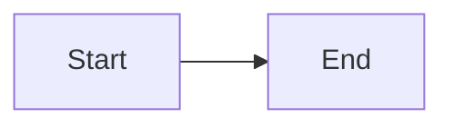
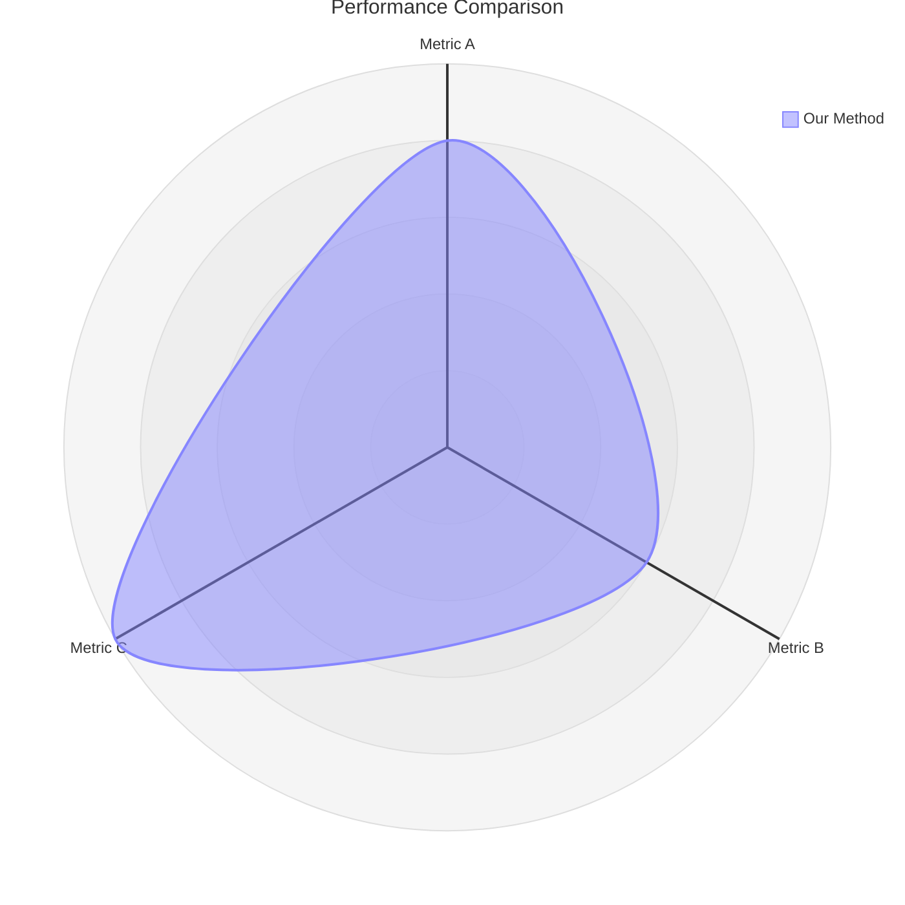

# Markdown & Mermaid Writing (Pipeline Extract)

## Core Philosophy

Use **Mermaid diagrams embedded in Markdown** as the default format for workflows, architectures, timelines, and relationships. Text-based diagrams diff cleanly in git, render natively everywhere, use fewer tokens than prose, and can be converted to polished images later.

**Three-phase workflow:**
1. **Phase 1 (ALWAYS):** Mermaid in Markdown — source of truth
2. **Phase 2 (optional):** Python-generated charts (data-driven visuals)
3. **Phase 3 (optional):** AI-generated images (publication polish)

## Mermaid Diagram Types (24 types)

| Use Case | Diagram Type |
|----------|-------------|
| Experimental workflow / decision logic | `flowchart` |
| Service interactions / API calls | `sequence` |
| Data model / schema | `er` |
| State machine / lifecycle | `state` |
| Project timeline / roadmap | `gantt` |
| Proportions / composition | `pie` |
| System architecture (zoom levels) | `c4` |
| Concept hierarchy / brainstorm | `mindmap` |
| Chronological events | `timeline` |
| Class hierarchy / type relationships | `class` |
| Two-axis comparison / prioritization | `quadrant` |
| Requirements traceability | `requirement` |
| Flow magnitude / resource distribution | `sankey` |
| Numeric trends (bar + line) | `xychart-beta` |
| Component layout | `block` |
| Multi-dimensional comparison | `radar-beta` |
| Hierarchical proportions | `treemap` |
| Git branching | `git-graph` |

## Mandatory Rules

- **`accTitle` + `accDescr`** on every diagram (accessibility)
- **No `%%{init}` directives** — breaks GitHub dark mode
- **No inline `style`** — use `classDef` only
- **`snake_case` node IDs** — match the label
- **One emoji per node max** — at start of label

### Radar Chart (Common Pitfall)

- Use **`radar-beta`**, not `radar` (doesn't exist)
- Use **`axis`** to define dimensions, not `x-axis`
- Use **`curve`** for data series, not quoted labels with colon

## Integration with Pipeline Skills

- **S5 diagrams:** Use Mermaid flowchart/mindmap/timeline for workflows, then optionally use `skills-embedded/scientific-schematics.md` for publication-quality PNG
- **Literature reviews:** Use Mindmap for concept maps, Timeline for publication history, Quadrant or Radar for methodology comparison
- **Thesis (T2):** Use mindmap to organize literature themes visually

## References

- Mermaid docs: https://mermaid.js.org/
